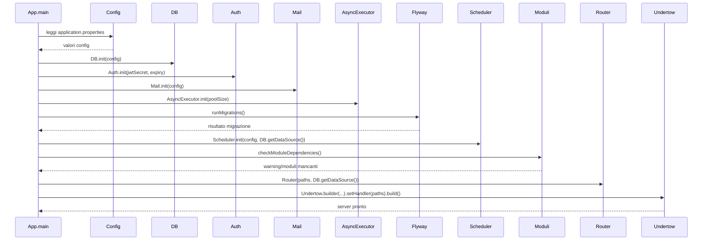

# WF-001-INITIALIZATION

### Inizializzazione entità applicative

### Obiettivo

Inizializzare tutte le componenti dell’applicazione, configurare servizi core e avviare il server.

### Attori

* Applicazione (`App.main`)
* Configurazione (`Config`)
* Database (`DB`)
* Autenticazione (`Auth`)
* Servizio email (`Mail`)
* Esecutore asincrono (`AsyncExecutor`)
* Flyway (`Flyway`)
* Scheduler (`Scheduler`)
* Moduli applicativi (`Moduli`)
* Router e server (`Undertow`)

### Precondizioni

* File di configurazione `application.properties` presente e valido
* Database accessibile
* Moduli necessari disponibili

---

### Flusso principale

1. `App.main` legge la configurazione tramite `Config`
2. Inizializza servizi core:

   * `DB.init(config)`
   * `Auth.init(jwtSecret, expiry)`
   * `Mail.init(config)`
   * `AsyncExecutor.init(poolSize)`
3. Esegue migrazioni DB tramite `Flyway.runMigrations()`
4. Inizializza lo scheduler con `Scheduler.init(config, DB.getDataSource())`
5. Verifica dipendenze dei moduli con `Modules.checkModuleDependencies()`
6. Configura router e static handler con `Router(paths, DB.getDataSource())`
7. Avvia server `Undertow` e logga che il server è pronto

---

### Postcondizioni

* Tutti i servizi core inizializzati correttamente
* Database aggiornato se necessario
* Server in ascolto pronto a ricevere richieste
* Eventuali warning sui moduli mancanti loggati

---

### Diagramma di sequenza

