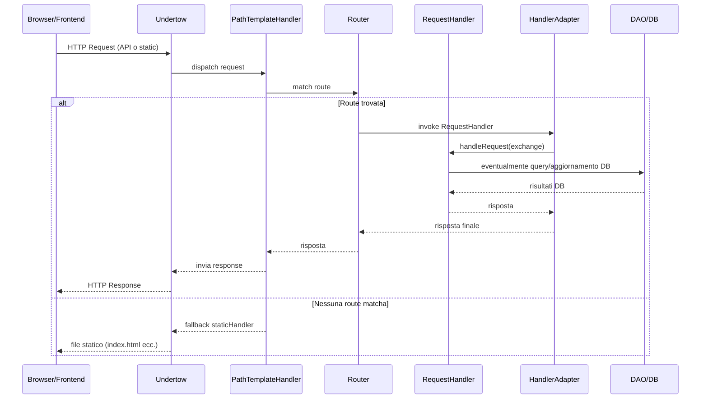

# WF-002-HTTP-REQUEST

### Gestione richiesta HTTP

### Obiettivo

Gestire le richieste HTTP in ingresso, instradarle verso il modulo appropriato e restituire la risposta corretta (API o contenuti statici).

### Attori

* Client (`Browser/Frontend`)
* Server (`Undertow`)
* Path dispatcher (`PathTemplateHandler`)
* Router (`Router`)
* Handler dei moduli (`RequestHandler`)
* Adapter (`HandlerAdapter`)
* Database/DAO (`DAO/DB`)

### Precondizioni

* Server in ascolto e operativo
* Routing configurato con le rotte dei moduli
* Moduli e DAO inizializzati

---

### Flusso principale

1. `Client` invia una richiesta HTTP al `Server`
2. `Server` passa la richiesta a `Paths` per il dispatch
3. `Paths` cerca una rotta tramite `Router`
4. Se la rotta esiste:

   * `Router` invoca `HandlerAdapter`
   * `HandlerAdapter` chiama `RequestHandler.handleRequest(exchange)`
   * `RequestHandler` interagisce con il `DAO` se necessario
   * Il risultato ritorna lungo la catena fino al `Client`
5. Se nessuna rotta matcha:

   * `Paths` fallback su staticHandler
   * `Server` restituisce il file statico richiesto

---

### Postcondizioni

* Richiesta HTTP elaborata correttamente
* Risposta inviata al client
* Eventuali errori o mancanze di rotta gestiti tramite fallback statico

---

### Diagramma di sequenza

