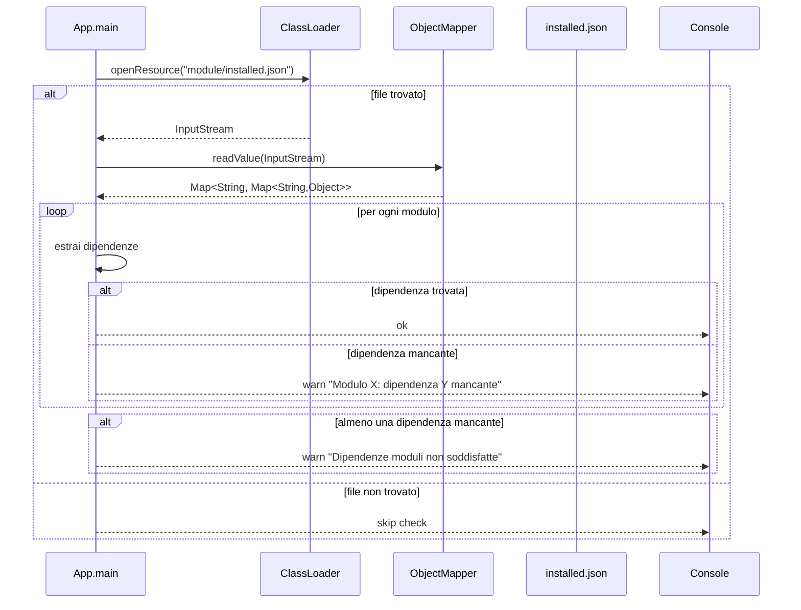

# WF-003-MODULE-DEPENDENCY-CHECK

### Check delle dipendenze dei moduli

### Obiettivo

Verificare che tutte le dipendenze dei moduli installati siano presenti e loggare eventuali mancanze.

### Attori

* Applicazione (`App.main`)
* Loader risorse (`ClassLoader`)
* Mapper JSON (`ObjectMapper`)
* File moduli installati (`installed.json`)
* Logger console (`Console`)

### Precondizioni

* File `installed.json` presente nel classpath (opzionale)
* Moduli installati correttamente

---

### Flusso principale

1. `App` apre `installed.json` tramite `ClassLoader`
2. Se il file esiste:

   * `ObjectMapper` converte il JSON in mappe Java
   * Per ogni modulo, estrai le dipendenze

     * Se la dipendenza è presente → log ok
     * Se mancante → log warning
   * Se almeno una dipendenza è mancante → log warning generale
3. Se il file non esiste → check saltato e log

---

### Postcondizioni

* Tutte le dipendenze verificate
* Warning loggati per dipendenze mancanti o check saltato

---

### Diagramma di sequenza

