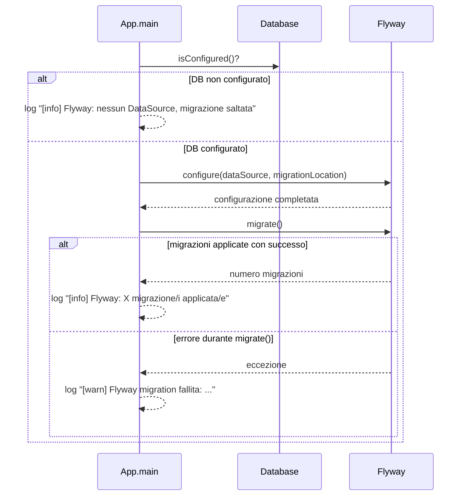

# WF-004-DB-MIGRATION

# Migrazione schema database

### Obiettivo

Allineare lo schema del database alla versione più recente tramite Flyway.

### Attori

* Applicazione (`App.main`)
* DB (`PostgreSQL`)
* Flyway (`Flyway`)

### Precondizioni

* `DB` configurato (`DB.isConfigured() == true`)
* Script di migrazione presenti in `classpath:db/migration`

---

### Flusso principale

1. `App` verifica se il `DB` è configurato
2. Se no → log `[info] Flyway: nessun DataSource, migrazione saltata` → termina
3. Se sì → configura Flyway con il `DataSource`
4. Flyway legge le migrazioni disponibili
5. Flyway applica le migrazioni non ancora eseguite
6. Log del numero di migrazioni applicate `[info] Flyway: X migrazione/i applicata/e`
7. In caso di errore → log `[warn] Flyway migration fallita: ...`

---

### Postcondizioni

* Schema DB aggiornato alla versione più recente **oppure**
* Migrazione fallita con warning loggato

---

### Diagramma di sequenza

