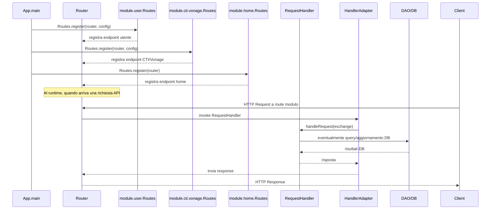

# WF-005-MODULE-ROUTING

### Routing dei moduli

### Obiettivo

Registrare le route dei moduli e instradare le richieste HTTP alle rispettive logiche di business.

### Attori

* Applicazione (`App.main`)
* Router (`Router`)
* Moduli applicativi (`module.user.Routes`, `module.cti.vonage.Routes`, `module.home.Routes`)
* Handler richieste (`RequestHandler`)
* Adapter (`HandlerAdapter`)
* Database/DAO (`DAO/DB`)

### Precondizioni

* Moduli installati e disponibili
* Router inizializzato
* DAO pronto per query/aggiornamenti

---

### Flusso principale

1. `App.main` registra le route di ciascun modulo:

   * `module.user.Routes.register(router, config)`
   * `module.cti.vonage.Routes.register(router, config)`
   * `module.home.Routes.register(router)`
2. Al runtime, quando arriva una richiesta API verso un modulo:

   * `Router` invoca `HandlerAdapter`
   * `HandlerAdapter` chiama `RequestHandler.handleRequest(exchange)`
   * `RequestHandler` interagisce con il `DAO` se necessario
   * La risposta risale la catena fino al `Client`

---

### Postcondizioni

* Tutte le route dei moduli registrate correttamente
* Richieste instradate e gestite dai moduli appropriati
* Risposta inviata al client

---

### Diagramma di sequenza

