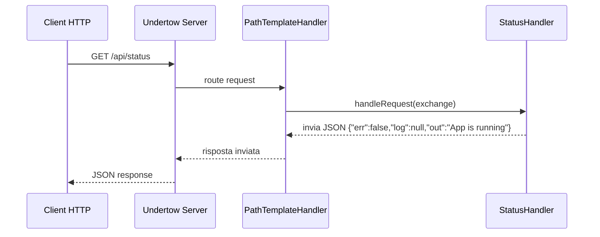

# WF-006-STATUS-ENDPOINT

### Health check endpoint

### Obiettivo

Fornire un endpoint per verificare lo stato dell’applicazione e supportare monitoring o health check automatici.

### Attori

* Client HTTP (`Client HTTP`)
* Server (`Undertow Server`)
* Path dispatcher (`PathTemplateHandler`)
* Handler dello status (`StatusHandler`)

### Precondizioni

* Server in ascolto
* Endpoint `/api/status` registrato

---

### Flusso principale

1. `Client` invia richiesta GET a `/api/status`
2. `Server` passa la richiesta a `PathTemplateHandler`
3. `PathTemplateHandler` instrada la richiesta a `StatusHandler`
4. `StatusHandler` genera risposta JSON:
   `{"err":false,"log":null,"out":"App is running"}`
5. La risposta risale la catena fino al `Client`

---

### Postcondizioni

* Client riceve risposta JSON con lo stato dell’applicazione

---

### Diagramma di sequenza

