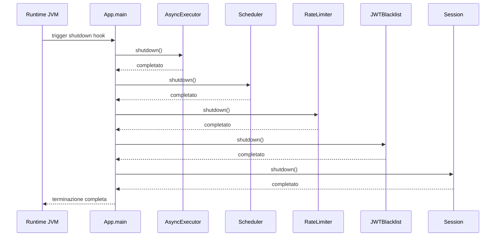

# WF-007-SHUTDOWN

### Terminazione controllata

### Obiettivo

Chiudere in modo ordinato tutti i servizi e liberare risorse prima dello stop dell’applicazione.

### Attori

* Runtime JVM (`Runtime JVM`)
* Applicazione (`App.main`)
* Esecutore asincrono (`AsyncExecutor`)
* Scheduler (`Scheduler`)
* Rate limiter (`RateLimiter`)
* JWT blacklist (`JWTBlacklist`)
* Gestione sessioni (`Session`)

### Precondizioni

* Applicazione in esecuzione
* Servizi inizializzati

---

### Flusso principale

1. `Runtime JVM` attiva lo shutdown hook
2. `App.main` chiama `AsyncExecutor.shutdown()`, attende completamento
3. `App.main` chiama `Scheduler.shutdown()`, attende completamento
4. `App.main` chiama `RateLimiter.shutdown()`, attende completamento
5. `App.main` chiama `JWTBlacklist.shutdown()`, attende completamento
6. `App.main` chiama `Session.shutdown()`, attende completamento
7. Terminazione completata e risorse rilasciate

---

### Postcondizioni

* Tutti i servizi terminati correttamente
* Nessuna risorsa pendente o thread attivi
* Sistema pronto per arresto sicuro

---

### Diagramma di sequenza

