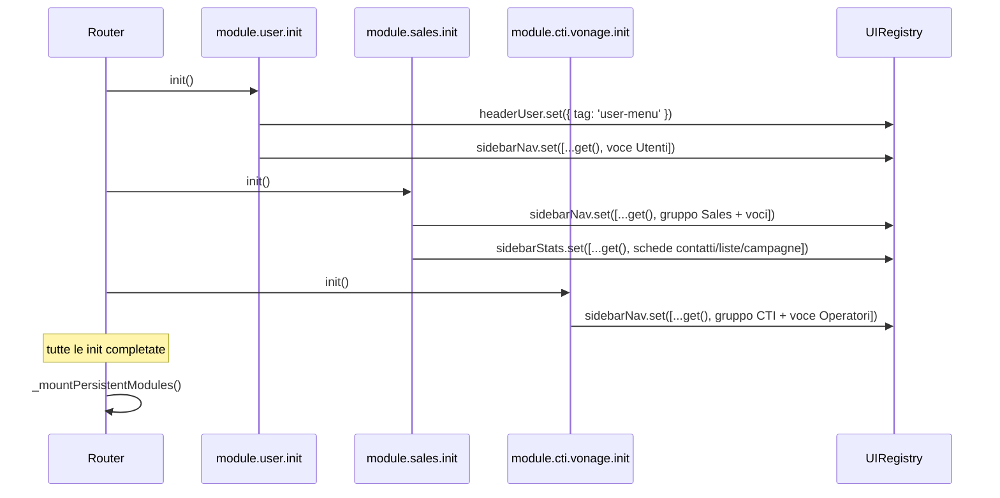
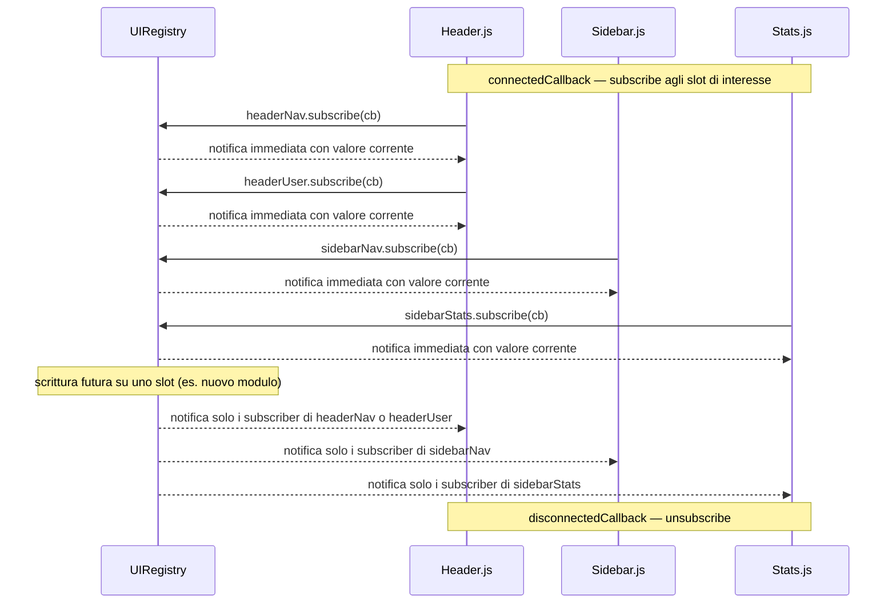

# WF-008-UIREGISTRY

### Registrazione e lettura dei componenti dinamici dell'interfaccia

### Obiettivo

Consentire ai moduli di contribuire componenti dinamici all'interfaccia (voci nav dell'header, slot user, voci sidebar, schede statistiche) senza dipendere dai moduli consumer che li ospitano.

### Attori

* Moduli applicativi (`module.*.init`) — produttori: scrivono sugli slot all'avvio
* `UIRegistry` — registro centralizzato: quattro atom nanostores indipendenti
* Componenti consumer (`Header`, `Sidebar`, `Stats`) — consumatori: leggono e reagiscono agli slot

### Precondizioni

* `store.js` caricato prima di qualsiasi `init.js`
* Le procedure `init` vengono eseguite dal Router prima del montaggio dei moduli persistent

---

### Flusso di scrittura

1. Il Router esegue in parallelo tutte le `init.js` dichiarate in `MODULE_CONFIG`
2. Ogni `init.js` importa `UIRegistry` da `store.js` e scrive sullo slot di interesse:
   - `UIRegistry.headerUser.set(...)` — singleton, sostituisce il valore
   - `UIRegistry.sidebarNav.set([...UIRegistry.sidebarNav.get(), ...items])` — append
   - `UIRegistry.sidebarStats.set([...UIRegistry.sidebarStats.get(), ...items])` — append
3. Ogni scrittura notifica i subscriber dello slot corrispondente
4. Solo dopo il completamento di tutte le `init` il Router monta i moduli persistent

### Flusso di lettura

1. Il componente consumer (es. `Header`, `Sidebar`) si monta nel DOM
2. In `connectedCallback` sottoscrive l'atom di proprio interesse: `UIRegistry.<slot>.subscribe(...)`
3. nanostores notifica il subscriber con il valore corrente al momento della subscribe
4. Ad ogni aggiornamento successivo dello slot il subscriber riceve il nuovo valore e aggiorna il render
5. In `disconnectedCallback` il consumer chiama l'unsubscribe per evitare memory leak

---

### Postcondizioni

* I componenti consumer riflettono tutti gli item registrati dai moduli
* Nessun modulo producer importa nulla dal consumer che lo ospita
* Nessun consumer conosce i moduli che scrivono sullo slot
* Aggiungere un nuovo slot richiede solo una nuova proprietà statica in `UIRegistry`

---

### Slot disponibili

| Proprietà | Tipo | Consumer | Cardinalità |
|---|---|---|---|
| `UIRegistry.headerNav` | `atom([])` | `Header.js` | array, più moduli |
| `UIRegistry.headerUser` | `atom(null)` | `Header.js` | singleton, un solo modulo |
| `UIRegistry.sidebarNav` | `atom([])` | `Sidebar.js` | array, più moduli |
| `UIRegistry.sidebarStats` | `atom([])` | `Stats.js` | array, più moduli |
| `UIRegistry.notifications` | `atom([])` | `Notifications.js` | array, più moduli |

Forma voce `notifications`: `{ id: string, message: string, type: 'info'|'success'|'warning'|'danger' }`.
I moduli non costruiscono l'oggetto direttamente ma usano il metodo helper: `UIRegistry.notify(message, type)`.

---

### Diagramma 1 — Scrittura (moduli → UIRegistry)

---

### Diagramma 2 — Lettura (UIRegistry → consumer)

