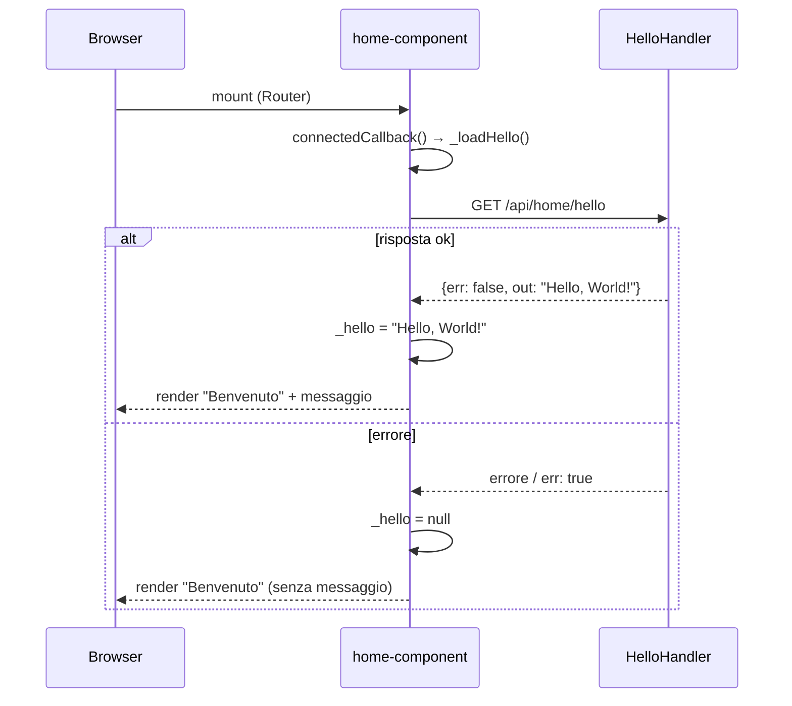

# WF-HOME-001-HELLO

### Pagina home con messaggio di benvenuto

### Obiettivo

Visualizzare la pagina home dell'applicazione con un messaggio di benvenuto recuperato dall'API. La rotta è pubblica e non richiede autenticazione.

### Attori

* Utente (`Browser`)
* Componente home (`Home.js` → `<home-component>`)
* Handler (`HelloHandler.hello`)

### Precondizioni

* Nessuna autenticazione richiesta
* Modulo home registrato in `config.js` come `DEFAULT_MODULE` o con rotta dedicata

---

### Flusso principale

1. Router monta `<home-component>` nel container `#main`
2. `connectedCallback()` chiama `_loadHello()`
3. `_loadHello()` esegue `GET /api/home/hello`
4. `HelloHandler.hello` risponde con `{err: false, out: "Hello, World!"}`
5. `<home-component>` aggiorna `_hello` → re-render con il messaggio
6. Risposta: pagina con titolo "Benvenuto" e testo del messaggio

### Flusso alternativo — Errore di rete o risposta con err

* `_hello` rimane `null`
* La pagina mostra solo il titolo "Benvenuto" senza testo aggiuntivo

---

### Postcondizioni

* Nessuna modifica al DB
* Pagina renderizzata con o senza il messaggio in base alla disponibilità dell'API

---

### Diagramma di sequenza

