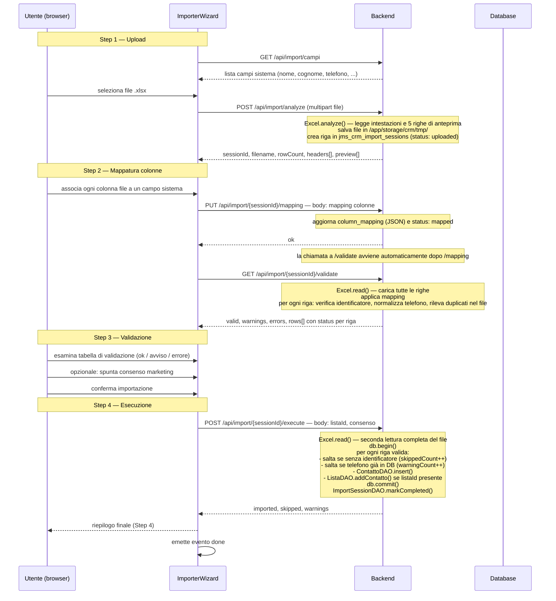

# wf_001 — Importazione lista contatti da file Excel

Un utente autenticato carica un file Excel contenente contatti, mappa le colonne del file
ai campi del sistema, verifica il risultato della validazione e avvia l'importazione.
I contatti vengono inseriti in `jms_crm_contatti` e facoltativamente associati a una lista
in `jms_crm_lista_contatti`.

## Requisiti

- Ruolo minimo `USER`.
- File in formato `.xls` o `.xlsx`; la prima riga deve contenere le intestazioni.
- Almeno uno tra `nome`, `cognome`, `ragione_sociale` è obbligatorio per ogni riga.
- Contatti con telefono già presente in DB vengono saltati (warning, non errore bloccante).
- L'importazione è transazionale: o tutti i contatti validi vengono inseriti, o nessuno.
- La lista di destinazione è opzionale: se non specificata i contatti vengono creati
  senza associazione a nessuna lista.

## Punto di ingresso

Il wizard si apre dalla vista contatti di una lista:
`Liste.js → _renderContatti() → bottone "Importa da file" → _view = 'importer'`.

Il componente `<importer-wizard>` riceve `listaId` dalla lista corrente.
Al completamento emette `done` (ricarica i contatti della lista) o `cancel` (torna alla lista).

## Sessione di importazione

Il backend mantiene lo stato del wizard in `jms_crm_import_sessions`.
Ogni upload crea una riga con UUID come chiave primaria.
Lo stato avanza secondo la macchina:

```
uploaded → mapped → completed
                  ↘ failed
```

Il file Excel viene salvato in `/app/storage/crm/tmp/import_<random>.<ext>`
e rimane su disco fino alla pulizia manuale (nessun cleanup automatico).

## Flusso



## Endpoint

| Metodo | Path | Ruolo | Descrizione |
|--------|------|-------|-------------|
| `GET`  | `/api/import/campi` | USER | Elenco campi importabili del sistema |
| `POST` | `/api/import/analyze` | USER | Upload file, analisi, creazione sessione |
| `PUT`  | `/api/import/{id}/mapping` | USER | Salva mappatura colonne → campi |
| `GET`  | `/api/import/{id}/validate` | USER | Valida le righe con la mappatura salvata |
| `POST` | `/api/import/{id}/execute` | USER | Esegue l'importazione transazionale |

## Campi importabili

| Key sistema | Label UI |
|-------------|----------|
| `nome` | Nome |
| `cognome` | Cognome |
| `ragione_sociale` | Ragione Sociale |
| `telefono` | Telefono |
| `email` | Email |
| `indirizzo` | Indirizzo |
| `citta` | Città |
| `cap` | CAP |
| `provincia` | Provincia |
| `note` | Note |

## Regole di validazione (`/validate`)

Applicate in memoria su tutte le righe, senza toccare il DB:

| Condizione | Tipo | Effetto |
|------------|------|---------|
| `nome`, `cognome`, `ragione_sociale` tutti vuoti | Errore | Riga saltata in `/execute` |
| `telefono` assente | Avviso | Riga importata senza telefono |
| `telefono` duplicato nel file | Avviso | Solo la prima occorrenza viene importata |

Le righe con errori vengono saltate silenziosamente in `/execute` (`skippedCount`).
Le righe con avvisi vengono importate e conteggiate in `warnings`.

## Regole di esecuzione (`/execute`)

Applicate riga per riga in transazione:

| Condizione | Contatore | Comportamento |
|------------|-----------|---------------|
| Nessun identificatore | `skipped` | Riga saltata, nessun insert |
| Telefono già presente in DB (`existsByTelefono`) | `warnings` | Riga saltata, contatto esistente non modificato |
| Riga valida | `imported` | `ContattoDAO.insert()` + `ListaDAO.addContatto()` se `listaId` presente |

Trasformazioni applicate ai valori prima dell'insert:
- `nome`, `cognome`: `capitalize()` — prima lettera maiuscola per ogni parola
- `telefono`: `normalize()` — rimozione spazi e trattini
- `email`: `toLowerCase()`

## Schema DB coinvolto

```
jms_crm_import_sessions
  id             VARCHAR(36) PK   — UUID della sessione
  filename       VARCHAR(255)     — nome originale del file
  file_path      VARCHAR(500)     — path assoluto del file temporaneo
  row_count      INTEGER          — righe totali (esclusa intestazione)
  headers        TEXT             — JSON array delle intestazioni
  preview        TEXT             — JSON array di 5 righe di anteprima
  column_mapping TEXT             — JSON mapping colonna_file → campo_sistema
  status         VARCHAR(50)      — uploaded | mapped | completed | failed
  error_message  TEXT             — valorizzato solo se status = failed
  created_at     TIMESTAMP
  updated_at     TIMESTAMP
  completed_at   TIMESTAMP

jms_crm_contatti
  id             SERIAL PK
  nome, cognome, ragione_sociale, telefono, email, ...
  stato          INTEGER          — 1 (attivo) al momento dell'import
  consenso       BOOLEAN          — valore dal checkbox step 3
  blacklist      BOOLEAN          — false al momento dell'import
  created_at, updated_at

jms_crm_lista_contatti
  lista_id       INT FK → jms_crm_liste.id
  contatto_id    INT FK → jms_crm_contatti.id
  UNIQUE(lista_id, contatto_id)   — ON CONFLICT DO NOTHING
```

## Classi coinvolte

| Classe | Responsabilità |
|--------|----------------|
| `ImporterHandler` | Orchestrazione dei 5 endpoint del wizard |
| `ImportSessionDAO` | CRUD su `jms_crm_import_sessions` |
| `ContattoDAO` | `insert()`, `existsByTelefono()` |
| `ListaDAO` | `addContatto()` — associazione a lista |
| `Excel` (util) | `analyze()` per anteprima, `read()` per import completo |
| `ImporterWizard.js` | Componente Lit — gestisce i 4 step e le chiamate API |
| `Liste.js` | Ospita e attiva il wizard dalla vista contatti di una lista |

## Limitazioni note

- Il file temporaneo non viene eliminato dopo l'import; il cleanup è manuale.
- Le sessioni completate o fallite non scadono automaticamente.
- `/validate` non verifica duplicati contro il DB (solo nel file); i duplicati DB vengono
  scoperti solo in `/execute` e conteggiati come `warnings`.
- Il file Excel viene letto due volte: una in `/validate` e una in `/execute`.
- Non è previsto un endpoint per cancellare o riaprire una sessione esistente.
