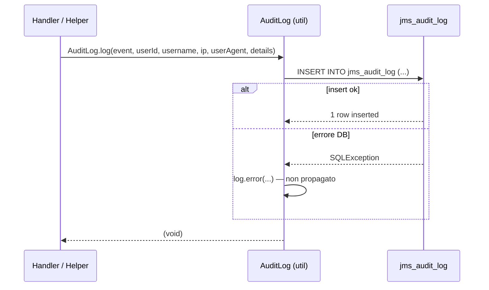

# WF-AUDIT-001-AUDIT-LOG

### Logging strutturato degli eventi

### Obiettivo

Fornire una tabella condivisa `jms_audit_log` in cui qualsiasi modulo può registrare eventi di sistema in modo strutturato tramite la classe utilitaria `AuditLog`. Il modulo audit è migration-only: non espone API né interfaccia frontend, si limita a creare lo schema DB.

### Attori

* Qualsiasi modulo che chiama `AuditLog` (`AuditLog.java`)
* Database PostgreSQL (`jms_audit_log`)

### Precondizioni

* Modulo `audit` installato e migration eseguita da Flyway
* `AuditLog` è una classe statica della libreria `dev.jms.util` — non richiede inizializzazione

---

### Schema tabella `jms_audit_log`

| Colonna      | Tipo                     | Note                              |
|--------------|--------------------------|-----------------------------------|
| `id`         | BIGSERIAL PK             | Chiave primaria auto-incrementale |
| `timestamp`  | TIMESTAMP WITH TIME ZONE | Default `NOW()`                   |
| `event`      | VARCHAR(50)              | Identificatore evento (es. `login`, `logout`) |
| `user_id`    | INTEGER                  | ID account (nullable)             |
| `username`   | VARCHAR(100)             | Username al momento dell'evento (nullable) |
| `ip_address` | VARCHAR(45)              | IPv4 o IPv6 (nullable)            |
| `user_agent` | TEXT                     | User-Agent HTTP (nullable)        |
| `details`    | JSONB                    | Dati aggiuntivi liberi (nullable) |

### Indici

* `(user_id, timestamp DESC)` — ricerca per utente ordinata per data
* `(event, timestamp DESC)` — ricerca per tipo evento
* `(timestamp DESC)` — log cronologico globale
* `(ip_address, timestamp DESC)` — ricerca per IP (analisi accessi sospetti)

---

### Flusso — Scrittura evento

1. Un handler o helper chiama `AuditLog.log(event, userId, username, ip, userAgent, details)`
2. `AuditLog` esegue `INSERT INTO jms_audit_log (...)` con i parametri forniti
3. Se la scrittura fallisce, l'errore viene loggato a livello ERROR ma **non propagato** — l'operazione principale non viene interrotta
4. Nessuna risposta al chiamante (metodo void)

---

### Postcondizioni

* Riga inserita in `jms_audit_log`
* In caso di errore DB: nessuna riga inserita, nessuna eccezione propagata

---

### Diagramma di sequenza

