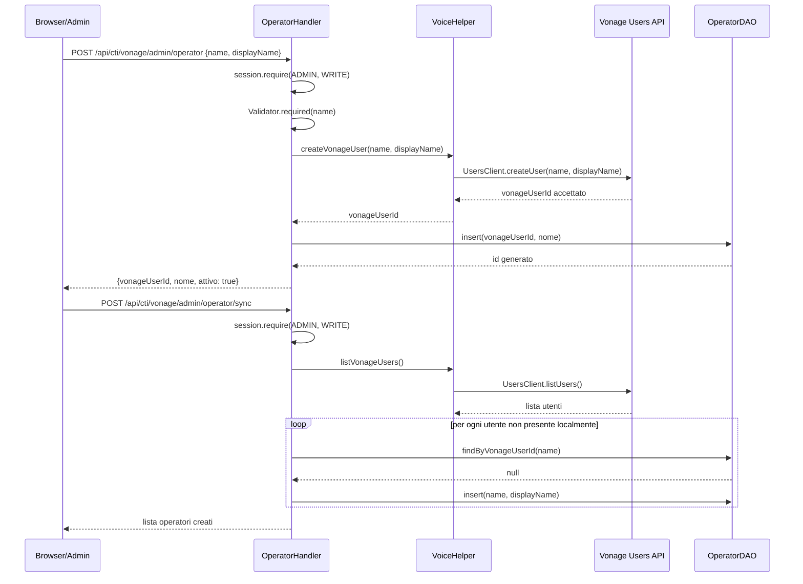

# WF-CTI-001-PROVISIONING-OPERATORI

### Provisioning operatori CTI (admin)

### Obiettivo

Creare e registrare gli operatori CTI: ogni operatore deve esistere sia su Vonage (come utente dell'applicazione) sia localmente (tabella `jms_cti_operatori`). Workflow eseguito dall'amministratore prima che qualunque operatore possa connettersi.

### Attori

* Amministratore (`Browser/Admin`)
* Handler operatori (`OperatorHandler`)
* Vonage Users API (`VoiceHelper.createVonageUser`)
* DAO locale (`OperatorDAO`)

### Precondizioni

* Credenziali Vonage configurate (`cti.vonage.application_id`, `cti.vonage.private_key`)
* Amministratore autenticato con ruolo ADMIN

---

### Flusso principale — Creazione singola

1. Admin invia `POST /api/cti/vonage/admin/operator` con `{name, displayName}`
2. `OperatorHandler.create` valida che `name` sia presente
3. `VoiceHelper.createVonageUser(name, displayName)` chiama la Vonage Users API
4. Vonage restituisce il nome utente accettato (diventa `vonage_user_id`)
5. `OperatorDAO.insert(vonageUserId, nome)` crea il record locale con `attivo = TRUE`
6. Risposta: `{vonageUserId, nome, attivo: true}`

### Flusso alternativo — Sincronizzazione da Vonage

1. Admin invia `POST /api/cti/vonage/admin/operator/sync`
2. `VoiceHelper.listVonageUsers()` recupera tutti gli utenti dall'applicazione Vonage
3. Per ogni utente Vonage non presente in `jms_cti_operatori`, `OperatorDAO.insert()` crea il record locale
4. Utenti locali senza corrispondente su Vonage non vengono toccati
5. Risposta: lista degli operatori locali creati

---

### Postcondizioni

* Ogni operatore ha una riga in `jms_cti_operatori` con il suo `vonage_user_id`
* Il `vonage_user_id` sarà il claim `sub` del JWT SDK al momento della connessione
* Nessun claim attivo (`claim_account_id = NULL`)

---

### Diagramma di sequenza

