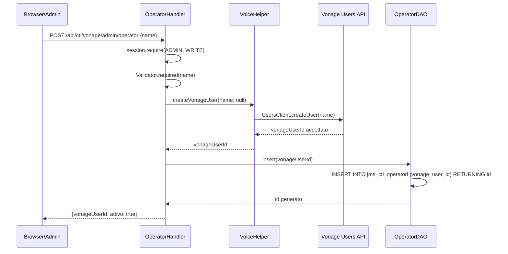
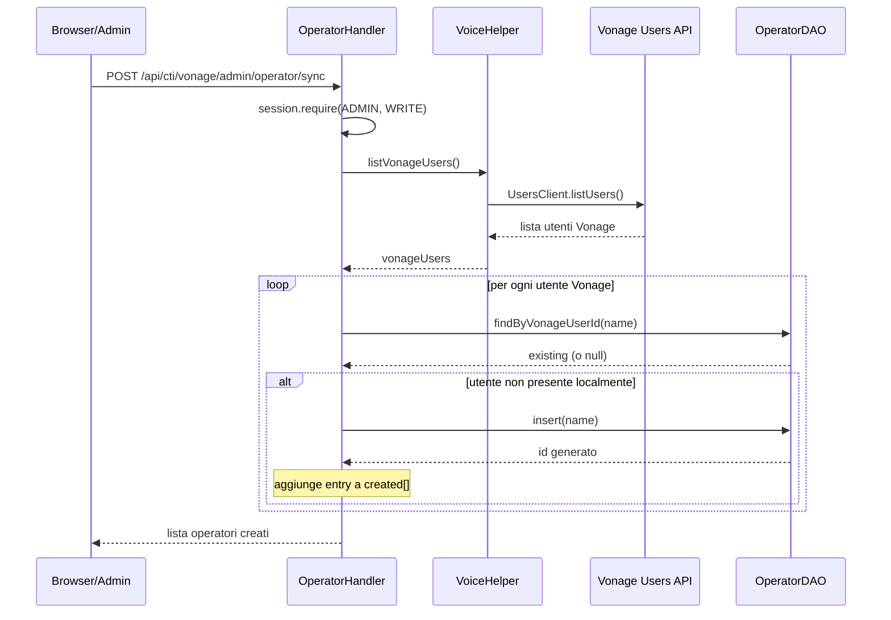
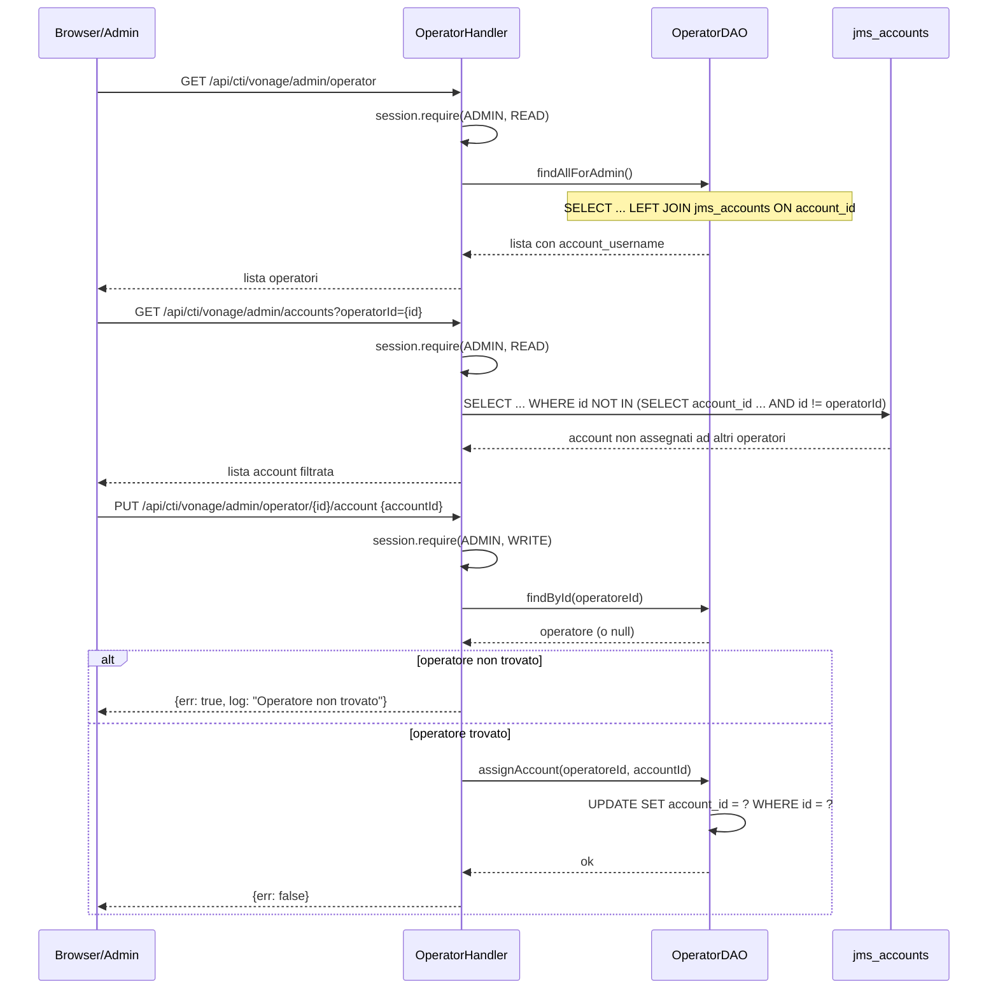
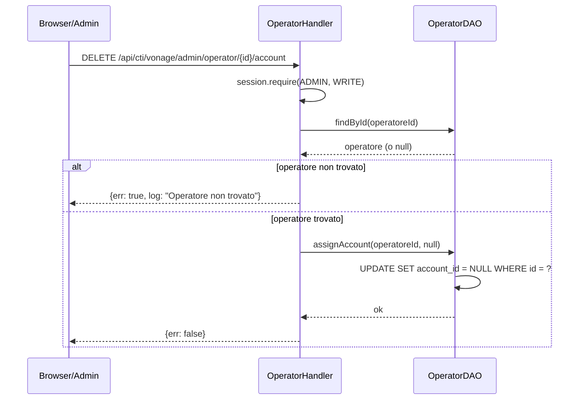

# WF-CTI-001-PROVISIONING-OPERATORI

### Provisioning operatori CTI (admin)

### Obiettivo

Creare, registrare e associare gli operatori CTI. Ogni operatore deve esistere sia su Vonage (come utente dell'applicazione) sia localmente (tabella `jms_cti_operatori`). L'associazione permanente tra un account utente (`jms_accounts.id`) e un operatore (`jms_cti_operatori.account_id`) è il requisito necessario perché quell'utente possa connettersi al CTI.

### Attori

* Amministratore (`Browser/Admin`)
* Handler operatori (`OperatorHandler`)
* Vonage Users API (`VoiceHelper.createVonageUser`)
* DAO locale (`OperatorDAO`)

### Precondizioni

* Credenziali Vonage configurate (`cti.vonage.application_id`, `cti.vonage.private_key`)
* Amministratore autenticato con ruolo ADMIN

---

### Flusso A — Creazione singola

1. Admin invia `POST /api/cti/vonage/admin/operator` con `{name}`
2. `OperatorHandler.create` valida che `name` sia presente
3. `VoiceHelper.createVonageUser(name, null)` chiama la Vonage Users API
4. Vonage restituisce il nome utente accettato (diventa `vonage_user_id`)
5. `OperatorDAO.insert(vonageUserId)` crea il record locale con `attivo = TRUE`, `account_id = NULL`
6. Risposta: `{vonageUserId, attivo: true}`

### Diagramma — Flusso A: Creazione singola

### Flusso B — Sincronizzazione da Vonage

1. Admin invia `POST /api/cti/vonage/admin/operator/sync`
2. `VoiceHelper.listVonageUsers()` recupera tutti gli utenti dall'applicazione Vonage
3. Per ogni utente Vonage non presente in `jms_cti_operatori`, `OperatorDAO.insert()` crea il record locale
4. Utenti locali senza corrispondente su Vonage non vengono toccati
5. Risposta: lista degli operatori locali creati

### Diagramma — Flusso B: Sincronizzazione da Vonage

### Flusso C — Assegnazione account utente a operatore

**Obbligatorio** prima che un utente possa connettersi al CTI (WF-CTI-002).

1. Admin apre la dashboard CTI → sezione Operatori
2. `Operators.js` carica la lista operatori via `GET /api/cti/vonage/admin/operator`
   - La risposta include `account_id` e `account_username` (JOIN con `jms_accounts`)
3. Admin clicca il pulsante "Assegna" su un operatore
4. `Operators.js` carica la lista account via `GET /api/cti/vonage/admin/accounts?operatorId={id}` — restituisce solo gli account non ancora assegnati ad altri operatori; l'account già assegnato all'operatore corrente (se presente) è incluso
5. Admin seleziona un account dal dropdown e conferma
6. `PUT /api/cti/vonage/admin/operator/{id}/account` con body `{accountId}`
7. `OperatorHandler.assignAccount` verifica che l'operatore esista, poi chiama `OperatorDAO.assignAccount(operatoreId, accountId)`
8. `UPDATE jms_cti_operatori SET account_id = ? WHERE id = ?`
9. La lista viene ricaricata: la colonna "Utente associato" mostra lo username

### Diagramma — Flusso C: Assegnazione account utente

### Flusso D — Rimozione associazione

1. Admin clicca "Rimuovi assegnazione" (pulsante visibile solo se `account_id` è impostato)
2. `DELETE /api/cti/vonage/admin/operator/{id}/account`
3. `OperatorDAO.assignAccount(operatoreId, null)` → `SET account_id = NULL`
4. L'utente precedentemente associato non potrà più connettersi al CTI

### Diagramma — Flusso D: Rimozione assegnazione

---

### Postcondizioni

* Ogni operatore ha una riga in `jms_cti_operatori` con il suo `vonage_user_id`
* Il `vonage_user_id` sarà il claim `sub` del JWT SDK al momento della connessione
* `account_id` è `NULL` alla creazione; deve essere impostato esplicitamente tramite Flusso C prima che l'utente possa connettersi
* `claim_account_id` è sempre `NULL` alla creazione (nessun claim attivo)
