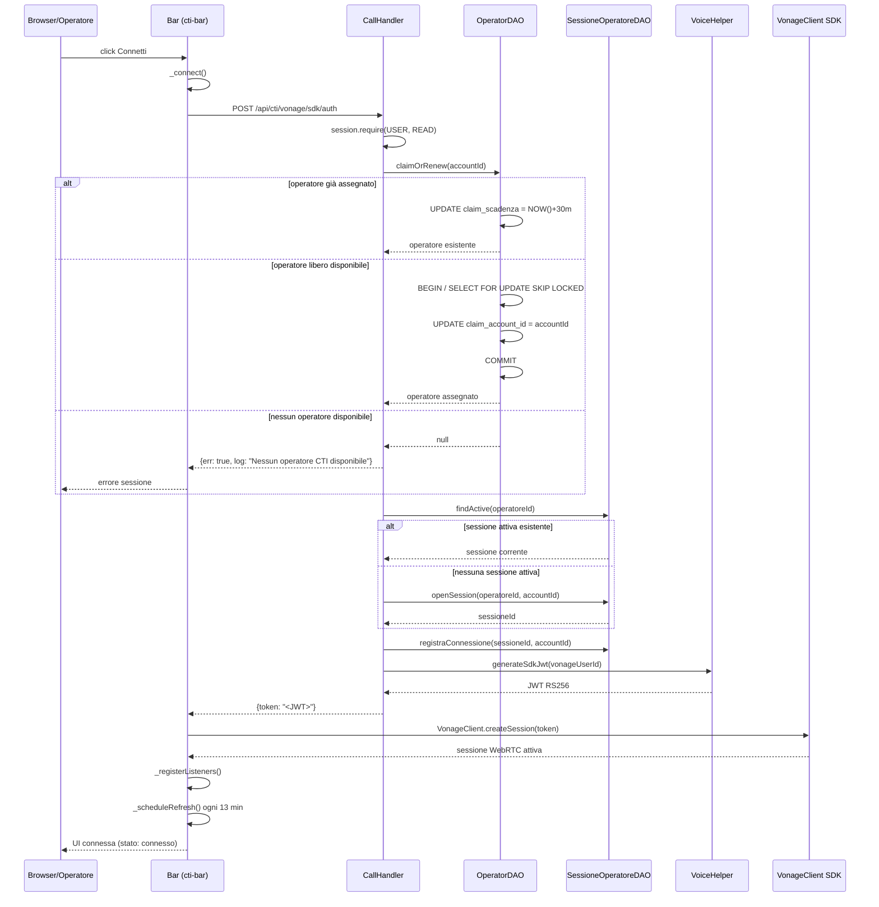

# WF-CTI-002-CONNESSIONE-OPERATORE

### Connessione operatore al CTI

### Obiettivo

L'operatore si connette al sistema CTI: il backend assegna un operatore libero tramite claim atomico, apre (o recupera) la sessione tecnica, genera il JWT RS256 per il Vonage Client SDK. Il frontend inizializza la sessione WebRTC e registra i listener sugli eventi del SDK.

### Attori

* Operatore (`Browser/Operatore`)
* Componente CTI (`Bar` — Lit element `<cti-bar>`)
* Backend CTI (`CallHandler.sdkToken`)
* DAO operatori (`OperatorDAO.claimOrRenew`)
* DAO sessioni (`SessioneOperatoreDAO`)
* Vonage SDK helper (`VoiceHelper.generateSdkJwt`)
* Client SDK Vonage (`VonageClient.createSession`)

### Precondizioni

* Operatore autenticato con ruolo USER
* Almeno un operatore CTI libero in `jms_cti_operatori` (`attivo = TRUE`, `claim_account_id = NULL`)

---

### Flusso principale

1. Operatore clicca "Connetti" → `Bar._connect()`
2. `Bar._fetchToken()` invia `POST /api/cti/vonage/sdk/auth`
3. `CallHandler.sdkToken` richiede `session.require(USER, READ)`
4. `OperatorDAO.claimOrRenew(accountId)`:
   * Se l'account ha già un claim attivo → rinnova `claim_scadenza = NOW() + 30 min` e restituisce l'operatore
   * Se non ha claim → `SELECT FOR UPDATE SKIP LOCKED` seleziona il primo operatore libero e imposta `claim_account_id = accountId`
5. Se nessun operatore disponibile → risposta `{err: true, log: "Nessun operatore CTI disponibile"}`
6. `SessioneOperatoreDAO.findActive(operatoreId)`:
   * Se esiste una sessione attiva (stato 1/2/3) → la riusa
   * Altrimenti → `openSession(operatoreId, accountId)` crea nuova sessione con stato 0
7. `SessioneOperatoreDAO.registraConnessione(sessioneId, accountId)`:
   * Imposta `connessione_inizio` (solo alla prima connessione), `ultima_connessione = NOW()`, `stato = 1`
8. `VoiceHelper.generateSdkJwt(vonageUserId)` genera JWT RS256 con claim `sub = vonageUserId` e ACL Vonage
9. Risposta: `{token: "<JWT RS256>"}`
10. `Bar`: `VonageClient.createSession(token)` inizializza la sessione WebRTC
11. `Bar._registerListeners()`: registra `callHangup`, `callAnswered`, `sessionError`
12. `Bar._scheduleRefresh()`: schedula rinnovo token ogni 13 minuti

---

### Postcondizioni

* Operatore CTI con `claim_account_id` impostato e `claim_scadenza` in futuro
* Sessione tecnica attiva in `jms_sessione_operatore` con `stato = 1`
* Sessione WebRTC Vonage attiva lato frontend
* Refresh token programmato ogni 13 minuti

---

### Diagramma di sequenza

