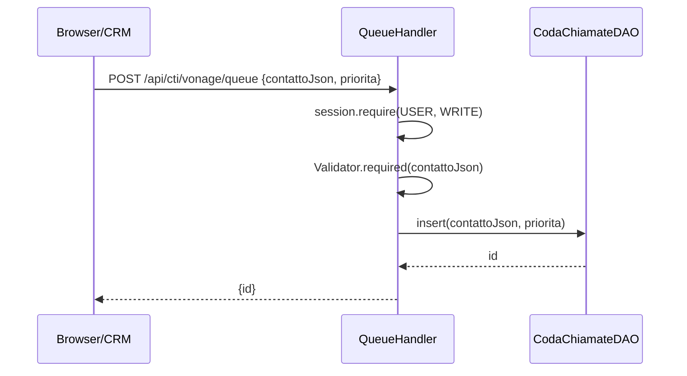
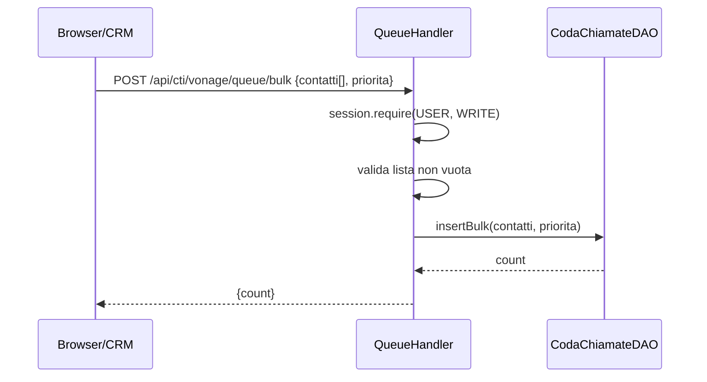

# WF-CTI-003-INSERIMENTO-CODA

### Inserimento contatti nella coda chiamate

### Obiettivo

Caricare uno o più contatti da chiamare nella coda condivisa `jms_cti_coda_chiamate`. Il caricamento può avvenire singolarmente (es. da un operatore) o in modo massivo (es. dal modulo CRM). La coda è persistente e condivisa tra tutti gli operatori.

### Attori

* Client chiamante (`Browser/CRM` oppure qualunque modulo integrato)
* Handler coda (`QueueHandler`)
* DAO coda (`CodaChiamateDAO`)

### Precondizioni

* Utente autenticato con ruolo USER
* Contatto serializzabile nel formato `{id?, phone, callback?, data: [{key, value, type}]}`

---

### Flusso principale — Inserimento singolo

1. Client invia `POST /api/cti/vonage/queue` con `{contattoJson: string, priorita?: number}`
2. `QueueHandler.addToQueue` richiede `session.require(USER, WRITE)`
3. `Validator.required(contattoJson)` valida la presenza del campo
4. `CodaChiamateDAO.insert(contattoJson, priorita)` inserisce il record con `stato = 'pending'`
5. Risposta: `{id: <id generato>}`

### Flusso alternativo — Inserimento massivo

1. Client invia `POST /api/cti/vonage/queue/bulk` con `{contatti: string[], priorita?: number}`
2. `QueueHandler.addBulkToQueue` richiede `session.require(USER, WRITE)`
3. Validazione: lista non nulla e non vuota
4. `CodaChiamateDAO.insertBulk(contatti, priorita)` inserisce tutti i record in un'unica operazione
5. Risposta: `{count: <numero inseriti>}`

---

### Postcondizioni

* Contatti presenti in `jms_cti_coda_chiamate` con `stato = 'pending'`
* Disponibili per estrazione tramite WF-CTI-004
