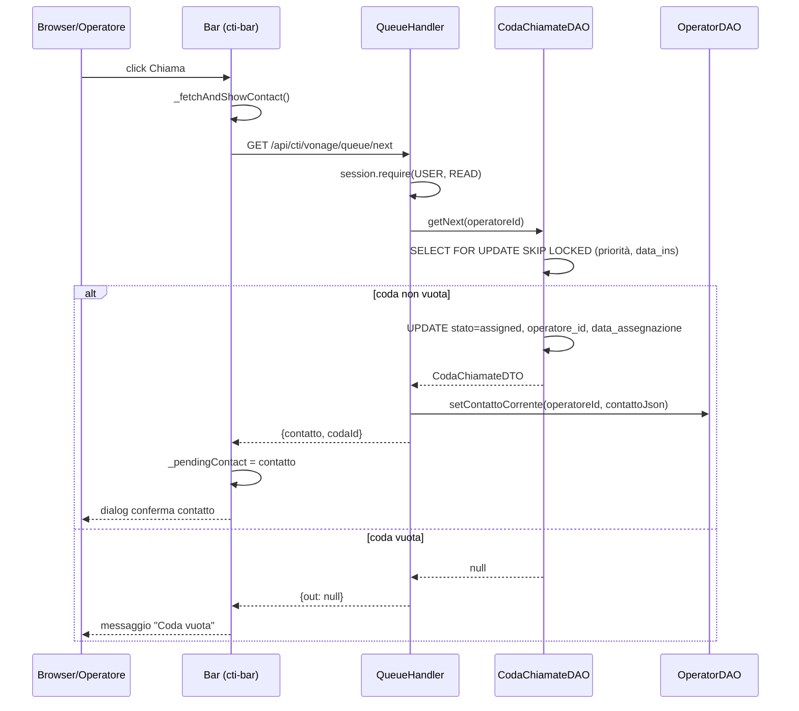

# WF-CTI-004-ESTRAZIONE-CONTATTO

### Estrazione contatto dalla coda e assegnazione all'operatore

### Obiettivo

L'operatore richiede il prossimo contatto da chiamare. Il backend preleva il primo contatto disponibile dalla coda condivisa (ordinato per priorità decrescente, poi per data inserimento crescente), lo marca come assegnato a quell'operatore, e lo salva nel campo `contatto_corrente` della riga operatore. Il frontend mostra un dialog di conferma prima di procedere alla chiamata.

### Attori

* Operatore (`Browser/Operatore`)
* Componente CTI (`Bar`)
* Handler coda (`QueueHandler.getNext`)
* DAO coda (`CodaChiamateDAO`)
* DAO operatori (`OperatorDAO`)

### Precondizioni

* Sessione WebRTC attiva (operatore connesso — WF-CTI-002)
* Almeno un contatto in `jms_cti_coda_chiamate` con `stato = 'pending'`
* Operatore non in chiamata attiva

---

### Flusso principale

1. Operatore clicca "Chiama" → `Bar._fetchAndShowContact()`
2. `Bar._fetchNextContact()` invia `GET /api/cti/vonage/queue/next`
3. `QueueHandler.getNext` richiede `session.require(USER, READ)`
4. `CodaChiamateDAO.getNext(operatoreId)`:
   * `SELECT … WHERE stato = 'pending' ORDER BY priorita DESC, data_inserimento ASC FOR UPDATE SKIP LOCKED LIMIT 1`
   * Aggiorna il record selezionato: `stato = 'assigned'`, `operatore_id = operatoreId`, `data_assegnazione = NOW()`
5. Se coda vuota → risposta `{out: null}` → Bar mostra "Coda vuota"
6. `OperatorDAO.setContattoCorrente(operatoreId, contattoJson)` persiste il contatto nella riga operatore
7. Risposta: `{contatto: <oggetto contatto>, codaId: <id>}`
8. Bar imposta `_pendingContact` e mostra dialog di conferma con i dati del contatto

---

### Postcondizioni

* Record in `jms_cti_coda_chiamate` con `stato = 'assigned'` e `operatore_id` impostato
* Campo `contatto_corrente` in `jms_cti_operatori` aggiornato
* Dialog di conferma visualizzato → il flusso prosegue con WF-CTI-005

---

### Diagramma di sequenza

