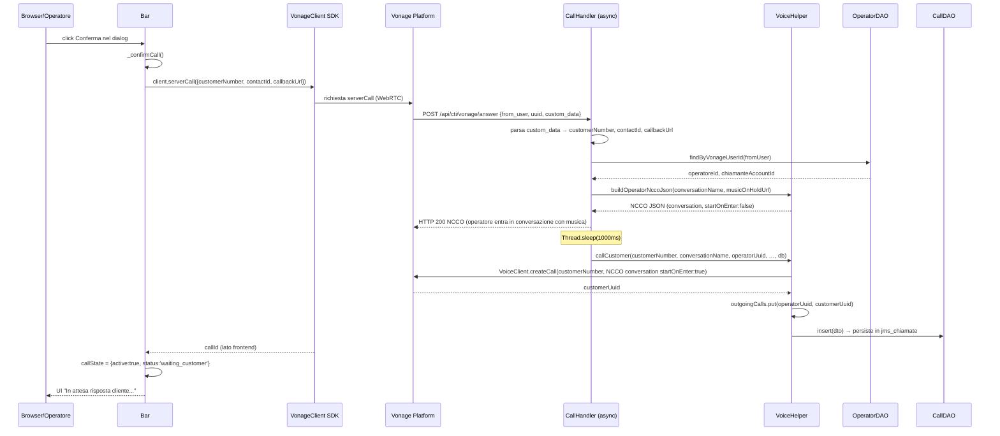

# WF-CTI-005-AVVIO-CHIAMATA

### Avvio chiamata outbound (operator-first progressive dialer)

### Obiettivo

L'operatore conferma la chiamata dal dialog. Il frontend esegue `client.serverCall()` via Vonage Client SDK, che triggera il webhook `POST /api/cti/vonage/answer`. Il backend risponde immediatamente con l'NCCO per l'operatore (musica di attesa), poi su thread asincrono chiama il cliente tramite Vonage Voice API e persiste il record in `jms_chiamate`.

### Attori

* Operatore (`Browser/Operatore`)
* Componente CTI (`Bar._confirmCall`)
* Vonage Platform (trigger webhook)
* Backend CTI (`CallHandler.answer` — rotta `async`)
* Helper voice (`VoiceHelper`)
* DAO chiamate (`CallDAO`)
* DAO operatori (`OperatorDAO`)

### Precondizioni

* Sessione WebRTC Vonage attiva
* Dialog di conferma visualizzato con `_pendingContact` impostato
* `customerNumber` presente nel contatto

---

### Flusso principale

1. Operatore clicca "Conferma" nel dialog → `Bar._confirmCall()`
2. Bar chiude il dialog, legge `number`, `contactId`, `callbackUrl` dal contatto
3. `client.serverCall({customerNumber, contactId, callbackUrl})` via Vonage Client SDK
4. Vonage invoca `POST /api/cti/vonage/answer` (rotta async) con body `{from_user, uuid, custom_data}`
5. `CallHandler.answer`:
   a. Legge `from_user` (= `vonage_user_id` dell'operatore), `uuid` (operatorUuid), `custom_data` (JSON con `customerNumber`, `contactId`, `callbackUrl`)
   b. `OperatorDAO.findByVonageUserId(fromUser)` → recupera `operatoreId` e `chiamanteAccountId`
   c. Genera `conversationName = "call-" + UUID.randomUUID()`
   d. `VoiceHelper.buildOperatorNccoJson(conversationName, musicOnHoldUrl)` → NCCO `conversation` con `startOnEnter: false`
   e. Invia risposta HTTP con l'NCCO (l'operatore entra nella conversazione, sente musica di attesa)
   f. `Thread.sleep(1000)` — attende 1 secondo
   g. `VoiceHelper.callCustomer(customerNumber, conversationName, operatorUuid, …, db)`:
      * Costruisce `Call` Vonage con NCCO `conversation` (stessa `conversationName`, `startOnEnter: true`)
      * `vonageClient.getVoiceClient().createCall(call)` → ottiene `customerUuid`
      * Registra `operatorUuid → customerUuid` in `outgoingCalls` (ConcurrentHashMap)
      * `CallDAO.insert(dto)` persiste il record in `jms_chiamate`
6. Bar imposta `callState = {active: true, callId, customerNumber, status: 'waiting_customer'}`

---

### Postcondizioni

* Operatore connesso alla conversazione Vonage (in attesa del cliente)
* Chiamata al cliente avviata tramite Vonage Voice API
* Record in `jms_chiamate` con `stato` iniziale e UUID della chiamata cliente
* `outgoingCalls` contiene la mappatura `operatorUuid → customerUuid`
* Il flusso prosegue con WF-CTI-006 (risposta cliente) o WF-CTI-008 (annullamento)

---

### Diagramma di sequenza

