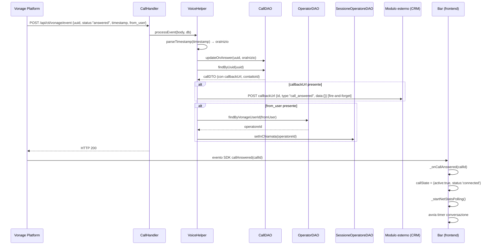

# WF-CTI-006-RISPOSTA-CLIENTE

### Risposta del cliente e conversazione attiva

### Obiettivo

Il cliente risponde alla chiamata. Vonage notifica l'evento `answered` via webhook; il backend aggiorna il record in `jms_chiamate`, porta la sessione tecnica dell'operatore allo stato "in chiamata" e invia la callback al modulo richiedente (es. CRM). Il Vonage Client SDK notifica l'evento `callAnswered` al frontend, che porta l'interfaccia in stato "conversazione attiva".

### Attori

* Vonage Platform (webhook)
* Backend CTI (`CallHandler.event`)
* Helper voice (`VoiceHelper.processEvent`)
* DAO chiamate (`CallDAO`)
* DAO operatori (`OperatorDAO`)
* DAO sessioni (`SessioneOperatoreDAO`)
* Modulo esterno / CRM (`callbackUrl` — opzionale)
* Frontend (`Bar` — evento SDK `callAnswered`)

### Precondizioni

* Chiamata cliente avviata (WF-CTI-005 completato)
* Il cliente risponde al telefono

---

### Flusso principale

1. Vonage invia `POST /api/cti/vonage/event` con `{uuid, status: "answered", timestamp, from_user}`
2. `CallHandler.event` delega a `VoiceHelper.processEvent(body, db)`
3. `processEvent` riconosce `status = "answered"`:
   a. `parseTimestamp(timestamp)` → `oraInizio`
   b. `CallDAO.updateOnAnswer(uuid, oraInizio)` → imposta `ora_inizio` e `stato` su `jms_chiamate`
   c. Se presente `callbackUrl`: `fireCallback(callbackUrl, contattoId, "call_answered", {})` (fire-and-forget su thread daemon)
   d. Se presente `from_user`: `OperatorDAO.findByVonageUserId(fromUser)` → `SessioneOperatoreDAO.setInChiamata(operatoreId)` → `stato = 3`
4. Vonage SDK notifica `callAnswered` al frontend
5. `Bar._onCallAnswered(callId)`: `callState = {active: true, status: 'connected'}` → avvia polling statistiche rete
6. Bar avvia timer conversazione (incrementa `_callSeconds` ogni secondo)

---

### Postcondizioni

* `jms_chiamate`: `ora_inizio` impostata, `stato` aggiornato
* `jms_sessione_operatore`: `stato = 3` (in chiamata)
* Frontend: UI "Conversazione attiva" con timer
* Callback inviata al modulo esterno (se `callbackUrl` presente)

---

### Diagramma di sequenza

