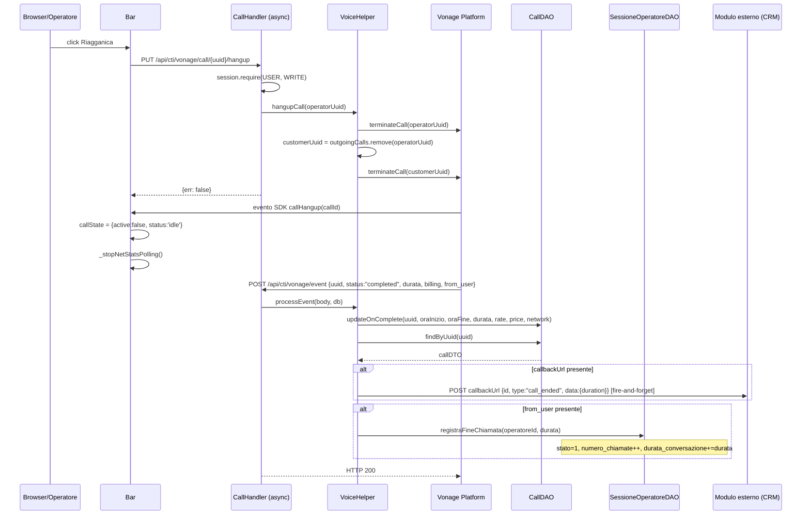

# WF-CTI-007-FINE-CHIAMATA

### Fine chiamata (hangup)

### Obiettivo

L'operatore riagganica la chiamata in corso. Il backend termina entrambe le legs (operatore e cliente) tramite Vonage Voice API. Vonage notifica l'evento `completed`; il backend aggiorna `jms_chiamate` con durata e dati di billing, riporta la sessione tecnica a "connesso" e invia la callback di fine chiamata al modulo esterno.

### Attori

* Operatore (`Browser/Operatore`)
* Componente CTI (`Bar`)
* Backend CTI (`CallHandler.hangup` — rotta `async`)
* Helper voice (`VoiceHelper.hangupCall`)
* Vonage Platform (webhook `completed`)
* DAO chiamate (`CallDAO`)
* DAO sessioni (`SessioneOperatoreDAO`)
* Modulo esterno / CRM (callback opzionale)

### Precondizioni

* Chiamata attiva con entrambe le legs connesse (WF-CTI-006 completato)

---

### Flusso principale — Hangup operatore

1. Operatore clicca il pulsante di riaggiancio → Bar invia `PUT /api/cti/vonage/call/{uuid}/hangup`
2. `CallHandler.hangup` richiede `session.require(USER, WRITE)`
3. `VoiceHelper.hangupCall(operatorUuid)`:
   a. `vonageClient.getVoiceClient().terminateCall(operatorUuid)` — termina leg operatore
   b. Cerca `customerUuid = outgoingCalls.remove(operatorUuid)`
   c. Se `customerUuid` presente → `terminateCall(customerUuid)` — termina leg cliente
4. Risposta al frontend: `{err: false}`
5. SDK Vonage notifica `callHangup` al frontend → `Bar._onCallHangup()` → `callState = idle`

### Flusso successivo — Evento `completed` da Vonage

6. Vonage invia `POST /api/cti/vonage/event` con `{uuid, status: "completed", start_time, end_time, duration, rate, price, network, from_user}`
7. `VoiceHelper.processEvent`:
   a. `CallDAO.updateOnComplete(uuid, oraInizio, oraFine, durata, rate, price, network)`
   b. Se `callbackUrl` presente: `fireCallback(callbackUrl, contattoId, "call_ended", {duration})`
   c. Se `from_user` presente: `SessioneOperatoreDAO.registraFineChiamata(operatoreId, durata)` → `stato = 1`, aggiorna `numero_chiamate`, `durata_conversazione`

---

### Postcondizioni

* `jms_chiamate`: `ora_fine`, `durata`, `tariffa`, `costo`, `rete` impostati
* `jms_sessione_operatore`: `stato = 1` (connesso), statistiche chiamata aggiornate
* Frontend: UI torna a stato idle
* Callback inviata al modulo esterno (se `callbackUrl` presente)
* `outgoingCalls`: mappatura rimossa

---

### Diagramma di sequenza

