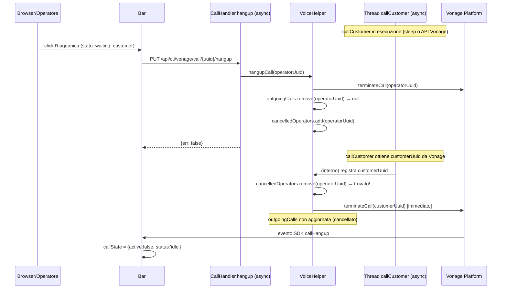

# WF-CTI-008-ANNULLAMENTO-PRE-RISPOSTA

### Annullamento chiamata prima della risposta del cliente

### Obiettivo

L'operatore riagganica mentre la chiamata al cliente è stata avviata ma il cliente non ha ancora risposto. Esiste una race condition: `hangupCall` può essere invocato prima che `callCustomer` abbia completato e registrato il `customerUuid` in `outgoingCalls`. Il modulo gestisce questo caso tramite la struttura `cancelledOperators`.

### Attori

* Operatore (`Browser/Operatore`)
* Componente CTI (`Bar`)
* Backend CTI (`CallHandler.hangup` — rotta `async`)
* Helper voice (`VoiceHelper`)
* Vonage Platform

### Precondizioni

* Chiamata avviata tramite WF-CTI-005 (operatore connesso alla conversazione)
* Cliente non ancora risposto (status `waiting_customer`)
* `callCustomer` ancora in esecuzione su thread asincrono (race condition possibile)

---

### Flusso principale — Hangup con `customerUuid` già disponibile

1. Operatore clicca riaggiancio → `PUT /api/cti/vonage/call/{uuid}/hangup`
2. `VoiceHelper.hangupCall(operatorUuid)`:
   a. `terminateCall(operatorUuid)`
   b. `customerUuid = outgoingCalls.remove(operatorUuid)` → trovato
   c. `terminateCall(customerUuid)`
3. Vonage notifica eventi di chiusura per entrambe le legs

### Flusso alternativo — Race condition: hangup prima del customerUuid

1. Operatore clicca riaggiancio durante `Thread.sleep(1000)` o mentre `callCustomer` chiama Vonage
2. `VoiceHelper.hangupCall(operatorUuid)`:
   a. `terminateCall(operatorUuid)`
   b. `outgoingCalls.remove(operatorUuid)` → **non trovato** (callCustomer non ha ancora registrato)
   c. `cancelledOperators.add(operatorUuid)` → registra l'intenzione di annullamento
3. Più tardi, `callCustomer` ottiene `customerUuid` da Vonage:
   a. `cancelledOperators.remove(operatorUuid)` → **trovato**
   b. `terminateCall(customerUuid)` → termina immediatamente la chiamata cliente
   c. La riga viene comunque inserita in `jms_chiamate` (stato: started ma chiuso subito)

---

### Postcondizioni

* Entrambe le legs terminate
* `outgoingCalls` pulita
* `cancelledOperators` pulita
* Frontend: `callState = idle` (via evento SDK `callHangup`)

---

### Diagramma di sequenza

