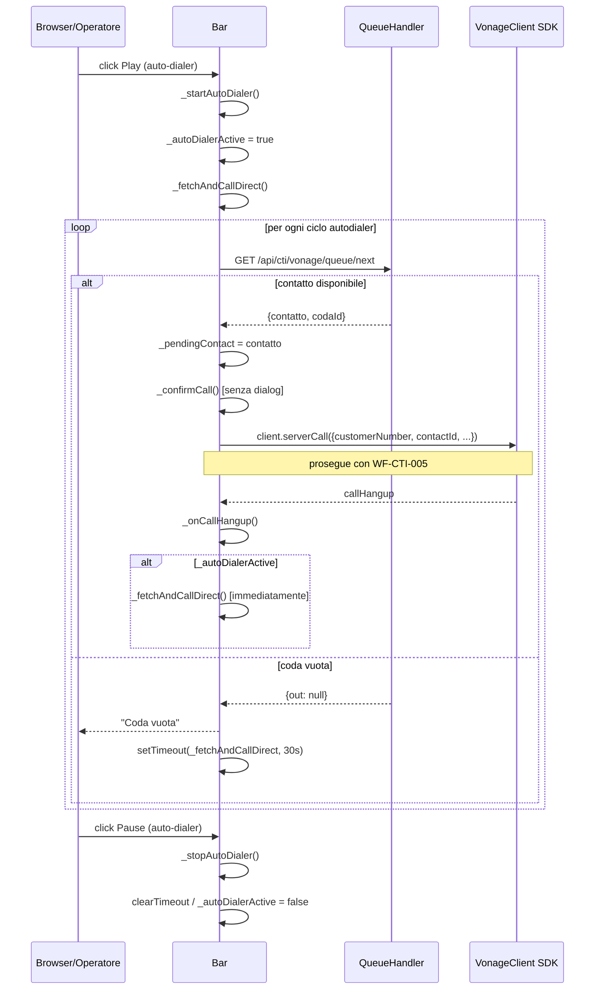

# WF-CTI-009-AUTODIALER

### Auto-dialer hands-free (chiamata continua automatica)

### Obiettivo

L'operatore attiva la modalità auto-dialer: il frontend preleva automaticamente il prossimo contatto dalla coda e avvia la chiamata **senza richiedere conferma manuale**. Alla fine di ogni chiamata, il contatto successivo viene estratto ed eseguito immediatamente. Se la coda è vuota, viene atteso un retry di 30 secondi prima di riprovare. L'auto-dialer si ferma solo se l'operatore lo disattiva esplicitamente.

### Attori

* Operatore (`Browser/Operatore`)
* Componente CTI (`Bar`)
* Backend coda (`QueueHandler.getNext`)
* Vonage Client SDK

### Precondizioni

* Sessione WebRTC attiva (WF-CTI-002 completato)
* Operatore non in chiamata attiva

---

### Flusso principale

1. Operatore clicca Play nella sezione auto-dialer → `Bar._toggleAutoDialer()`
2. `Bar._startAutoDialer()`:
   a. Imposta `_autoDialerActive = true`
   b. Chiama immediatamente `_fetchAndCallDirect()` (senza attesa)
3. `_fetchAndCallDirect()`:
   a. Invia `GET /api/cti/vonage/queue/next`
   b. Se contatto trovato: imposta `_pendingContact` e chiama direttamente `_confirmCall()` → avvia chiamata (senza dialog) — prosegue con WF-CTI-005
   c. Se coda vuota: mostra avviso "Coda vuota", schedula `setTimeout(_fetchAndCallDirect, 30s)`
4. Alla fine di ogni chiamata (`_onCallHangup`):
   a. Se `_autoDialerActive` → chiama di nuovo `_fetchAndCallDirect()` immediatamente (senza timer)
5. Operatore clicca Pause → `Bar._stopAutoDialer()`:
   a. `clearTimeout(_autoDialerTimer)` (cancella eventuale timer retry)
   b. `_autoDialerActive = false`

---

### Postcondizioni

* Auto-dialer attivo: chiamate consecutive senza intervento manuale, il contatto successivo viene estratto al termine di ogni chiamata
* Auto-dialer disattivato: operatore torna a modalità manuale
* Se coda vuota: retry automatico ogni 30 secondi finché non arriva un contatto; al contatto disponibile la chiamata parte immediatamente senza dialog

---

### Diagramma di sequenza

