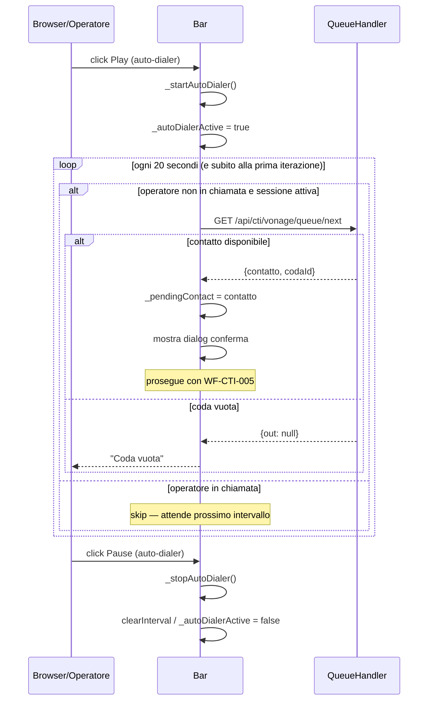

# WF-CTI-009-AUTODIALER

### Auto-dialer (chiamata continua automatica)

### Obiettivo

L'operatore attiva la modalità auto-dialer: ogni 20 secondi il frontend preleva automaticamente il prossimo contatto dalla coda e avvia la chiamata, senza richiedere conferma manuale. L'auto-dialer si ferma se la coda è vuota o se l'operatore è già in chiamata.

### Attori

* Operatore (`Browser/Operatore`)
* Componente CTI (`Bar`)
* Backend coda (`QueueHandler.getNext`)
* Vonage Client SDK

### Precondizioni

* Sessione WebRTC attiva (WF-CTI-002 completato)
* Operatore non in chiamata attiva
* Coda con contatti disponibili

---

### Flusso principale

1. Operatore clicca Play nella sezione auto-dialer → `Bar._toggleAutoDialer()`
2. `Bar._startAutoDialer()`:
   a. Imposta `_autoDialerActive = true`
   b. Chiama immediatamente `_fetchAndShowContact()` (prima iterazione senza attesa)
   c. Avvia `setInterval` ogni 20 secondi: se `!_callState.active && _sessionActive` → `_fetchAndShowContact()`
3. `_fetchAndShowContact()` → `_fetchNextContact()` → `GET /api/cti/vonage/queue/next`
4. Se contatto trovato: mostra dialog di conferma (flusso prosegue come WF-CTI-004 → WF-CTI-005)
5. Se coda vuota: mostra errore "Coda vuota", il timer continua a girare in attesa di nuovi inserimenti
6. Operatore clicca Pause → `Bar._stopAutoDialer()`:
   a. `clearInterval(_autoDialerTimer)`
   b. `_autoDialerActive = false`

---

### Postcondizioni

* Auto-dialer attivo: chiamate consecutive senza intervento manuale
* Auto-dialer disattivato: operatore torna a modalità manuale
* Se coda vuota il timer rimane attivo ma non avvia chiamate finché non arrivano nuovi contatti

---

### Diagramma di sequenza

