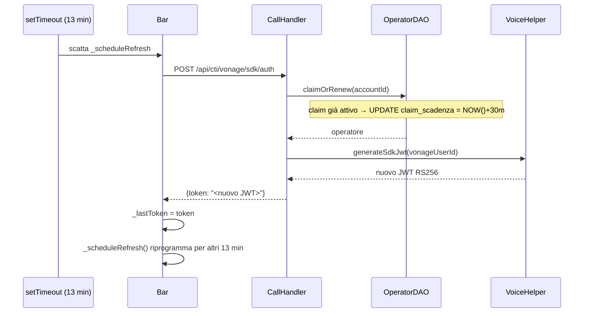

# WF-CTI-010-REFRESH-SESSIONE

### Refresh automatico della sessione SDK

### Obiettivo

Mantenere attiva la sessione Vonage Client SDK oltre la scadenza del JWT (1 ora). Il frontend rinnova il token ogni 13 minuti chiamando di nuovo `POST /api/cti/vonage/sdk/auth`. Il backend rinnova il `claim_scadenza` dell'operatore (+30 minuti). Questo impedisce che il claim venga rilasciato dallo scheduler di cleanup (WF-CTI-012) durante una sessione di lavoro attiva.

### Attori

* Componente CTI (`Bar._scheduleRefresh`)
* Backend CTI (`CallHandler.sdkToken`)
* DAO operatori (`OperatorDAO.claimOrRenew`)

### Precondizioni

* Sessione WebRTC attiva (WF-CTI-002 completato)
* `_refreshTimer` schedulato a 13 minuti

---

### Flusso principale

1. Timer `REFRESH_DELAY_MS = 13 * 60 * 1000` scatta
2. `Bar._fetchToken()` invia `POST /api/cti/vonage/sdk/auth`
3. `OperatorDAO.claimOrRenew(accountId)` trova il claim attivo e aggiorna `claim_scadenza = NOW() + 30 min`
4. Genera nuovo JWT RS256 con nuova scadenza (+1 ora)
5. `Bar._lastToken = token`
6. Il timer si riprogramma per il successivo refresh

### Flusso alternativo — Errore refresh

1. `_fetchToken()` fallisce (es. sessione scaduta, errore rete)
2. `Bar._connect()` cattura l'eccezione → `_sessionError` impostato
3. La sessione WebRTC rimane attiva finché Vonage non la scade

---

### Postcondizioni

* `claim_scadenza` rinnovata: la sessione rimane viva per altri 30 minuti
* JWT fresco disponibile per eventuali reconnect SDK

---

### Diagramma di sequenza

