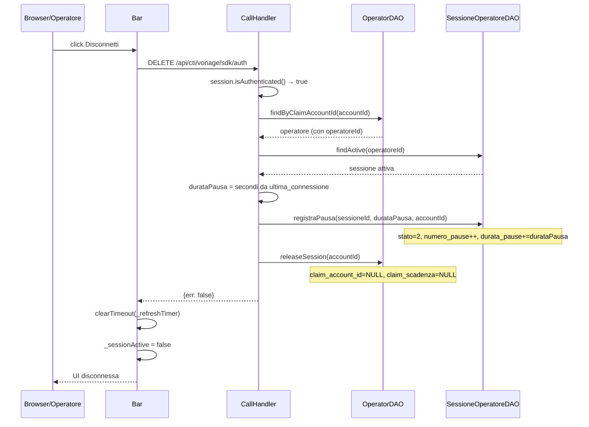

# WF-CTI-011-DISCONNESSIONE-OPERATORE

### Disconnessione operatore dal CTI

### Obiettivo

L'operatore termina la sessione di lavoro CTI. Il backend rilascia il claim sull'operatore, registra la pausa nella sessione tecnica e pulisce lo stato. Il frontend chiude la sessione WebRTC e azzera l'interfaccia.

### Attori

* Operatore (`Browser/Operatore`)
* Componente CTI (`Bar._teardown`)
* Backend CTI (`CallHandler.releaseSession`)
* DAO operatori (`OperatorDAO`)
* DAO sessioni (`SessioneOperatoreDAO`)

### Precondizioni

* Operatore connesso (sessione tecnica con `stato = 1` o `2`)
* Nessuna chiamata attiva (se presente, va terminata prima — WF-CTI-007)

---

### Flusso principale

1. Operatore clicca "Disconnetti" → `Bar._disconnect()` (o `disconnectedCallback` del componente)
2. Bar invia `DELETE /api/cti/vonage/sdk/auth`
3. `CallHandler.releaseSession`:
   a. Verifica autenticazione (`session.isAuthenticated()`)
   b. `OperatorDAO.findByClaimAccountId(accountId)` → recupera l'operatore con il claim attivo
   c. `SessioneOperatoreDAO.findActive(operatoreId)` → sessione attiva
   d. Calcola `durataPausa = secondi da ultima_connessione a NOW()`
   e. `SessioneOperatoreDAO.registraPausa(sessione.id, durataPausa, accountId)` → `stato = 2`, incrementa `numero_pause`, aggiunge `durata_pause`
   f. `OperatorDAO.releaseSession(accountId)` → `claim_account_id = NULL`, `claim_scadenza = NULL`
4. Risposta: `{err: false}`
5. Bar: cancella `_refreshTimer`, chiama `client.deleteSession()` (o lascia scadere il JWT), pulisce stato
6. Frontend torna a UI "Disconnesso"

---

### Postcondizioni

* `jms_cti_operatori`: `claim_account_id = NULL`, `claim_scadenza = NULL` — operatore libero per altri login
* `jms_sessione_operatore`: `stato = 2` (in pausa) con aggiornamento statistiche
* Sessione WebRTC Vonage chiusa lato frontend
* Nessun refresh programmato

---

### Diagramma di sequenza

