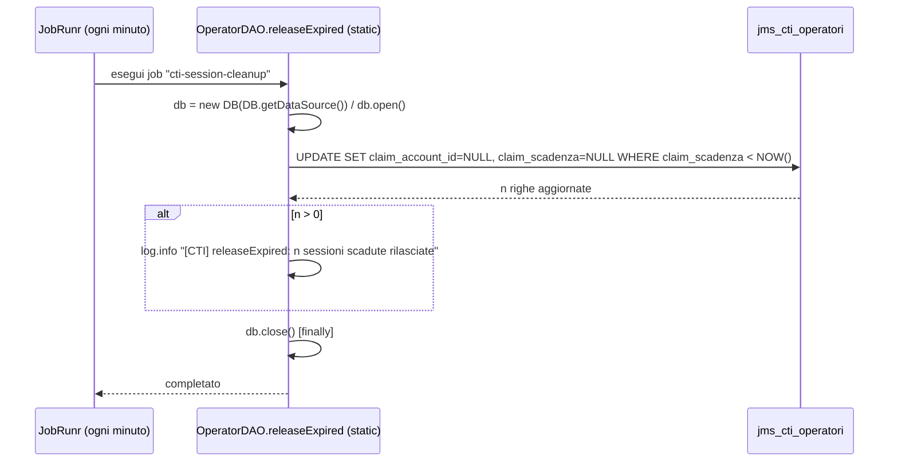

# WF-CTI-012-CLEANUP-SESSIONI-SCADUTE

### Cleanup automatico delle sessioni operatore scadute

### Obiettivo

Rilasciare automaticamente i claim sugli operatori CTI quando la sessione dell'operatore si è interrotta senza una disconnessione esplicita (es. chiusura browser, crash, perdita di rete). Il job schedulato esegue ogni minuto e garantisce che nessun operatore rimanga bloccato indefinitamente, rendendo il pool disponibile entro 31 minuti dall'interruzione.

### Attori

* Scheduler (`JobRunr` — job `cti-session-cleanup`)
* DAO operatori (`OperatorDAO.releaseExpired` — metodo statico)
* Database (`jms_cti_operatori`)

### Precondizioni

* Scheduler inizializzato e attivo (`scheduler.enabled = true`)
* Il job `cti-session-cleanup` registrato con cron `* * * * *` (ogni minuto)

---

### Flusso principale

1. JobRunr esegue `OperatorDAO.releaseExpired()` ogni minuto
2. Il metodo acquisisce autonomamente una connessione DB dal pool (`DB.getDataSource()`)
3. Esegue:
   ```sql
   UPDATE jms_cti_operatori
   SET claim_account_id = NULL, claim_scadenza = NULL
   WHERE claim_scadenza IS NOT NULL AND claim_scadenza < NOW()
   ```
4. Se `released > 0`: logga il numero di sessioni rilasciate
5. Chiude la connessione nel blocco `finally`

### Meccanismo di prevenzione

Il claim viene mantenuto vivo dal refresh automatico (WF-CTI-010): ogni 13 minuti il frontend chiama `POST /api/cti/vonage/sdk/auth` che aggiorna `claim_scadenza = NOW() + 30 min`. Se il browser scompare, il refresh non avviene più e il claim scade entro 30 minuti; il job lo rilascia nel minuto successivo.

**Tempo massimo di blocco**: 30 minuti (TTL claim) + 1 minuto (intervallo job) = **31 minuti**.

---

### Postcondizioni

* Operatori con claim scaduto tornano disponibili (`claim_account_id = NULL`)
* La sessione tecnica in `jms_sessione_operatore` rimane aperta con l'ultimo stato registrato (non viene chiusa automaticamente dallo scheduler)

---

### Diagramma di sequenza


