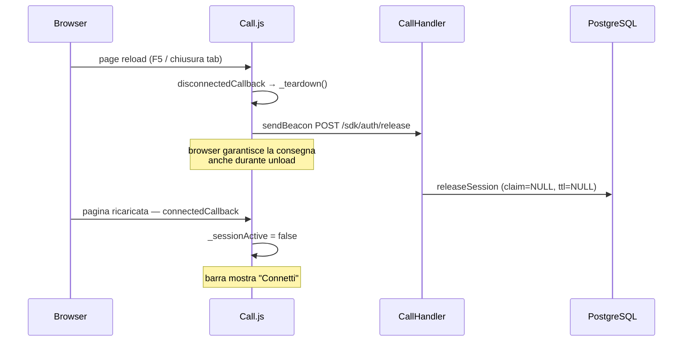
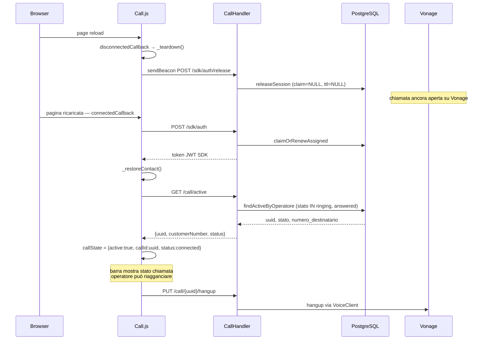

# WF-013 — Comportamento al Page Reload

## Contesto

Il modulo CTI mantiene stato sia in memoria (frontend) che su DB (backend). Un page
reload (F5, ricarica del browser, chiusura tab) distrugge il DOM e annulla le Promise
JavaScript in volo, rendendo inaffidabile la sequenza normale di teardown.

Questo workflow descrive i due scenari critici, il comportamento implementato e le
scelte progettuali adottate.

---

## Scenario A — Reload con sessione CTI attiva, nessuna chiamata in corso

### Diagramma di sequenza

### Comportamento

- Il backend riceve la release tramite `sendBeacon` (garantita anche durante unload).
- L'operatore viene rilasciato immediatamente: `claim_account_id = NULL`,
  `sessione_ttl = NULL`.
- Al reload la barra si presenta disconnessa, pronta per una nuova connessione.
- Lo scheduler `cti-session-cleanup` (ogni minuto) funge da safety net per i casi
  in cui `sendBeacon` fallisca per anomalie di rete.

---

## Scenario B — Reload con operatore in conversazione (chiamata attiva)

### Diagramma di sequenza

### Comportamento

- Al reconnect, dopo aver ottenuto il token SDK, il frontend chiama
  `GET /api/cti/vonage/call/active`.
- Il backend cerca in `jms_cti_chiamate` una riga con `stato IN ('ringing','answered')`
  associata all'operatore corrente.
- Se trovata, il frontend ripristina `callState` con `uuid`, `customerNumber` e
  `status` (`connected` se `answered`, `waiting_customer` se `ringing`).
- L'operatore vede la barra nello stato chiamata e può eseguire `hangup`.
- Il contatto nel dialog di conferma viene ripristinato separatamente da
  `_restoreContact()` (già esistente prima di questo workflow).

---

## Implementazione

### Endpoint aggiunti

| Metodo | Path | Handler | Note |
|--------|------|---------|------|
| `POST` | `/api/cti/vonage/sdk/auth/release`  | `CallHandler.releaseBeacon` | Equivalente di DELETE, accettato da `sendBeacon` |
| `GET`  | `/api/cti/vonage/call/active`       | `CallHandler.activeCall`    | Chiamata aperta dell'operatore corrente |
| `GET`  | `/api/cti/vonage/call/history`      | `CallHandler.list`          | Rinominata da `/call` per simmetria con `/call/active` |

Le route `/call/active` e `/call/history` sono sotto-risorse simmetriche di `/call`,
senza ambiguità di matching indipendentemente dall'ordine di registrazione in Undertow.

### Metodo DAO aggiunto

`CallDAO.findActiveByOperatore(long operatoreId)` — query su
`jms_cti_chiamate WHERE operatore_id = ? AND stato IN ('ringing','answered')
ORDER BY data_creazione DESC LIMIT 1`.

### Modifiche frontend (`Call.js`)

- `_teardown()`: sostituito `fetch DELETE` con `navigator.sendBeacon(POST /release)`.
- `_connect()`: aggiunta chiamata a `_restoreCallState()` dopo `_restoreContact()`.
- `_restoreCallState()`: nuovo metodo che interroga `/call/active` e aggiorna
  `callState` e `targetNumber` se trova una chiamata aperta.
- `_fetchCallHistory()`: aggiornato per chiamare `/call/history` (rinominata da `/call`).

---

## Perché `sendBeacon` invece di `fetch DELETE`

`fetch` con `method: DELETE` lanciato da `_teardown()` durante un page unload viene
annullato dal browser prima del completamento nella maggior parte dei casi: il DOM
viene distrutto, le Promise sono garbage-collected e la richiesta XHR viene abortita.

`navigator.sendBeacon(url, data)` è progettato esattamente per questo caso: il browser
accoda la richiesta in modo che venga completata anche dopo la distruzione del contesto
JavaScript. Limitazioni: accetta solo `POST`, payload limitato (~64 KB), nessuna
risposta leggibile. Queste limitazioni sono ininfluenti per il caso d'uso (rilascio
operatore, nessun body, nessun return value atteso).

---

## Safety net: scheduler `cti-session-cleanup`

Il job `cti-session-cleanup` (ogni minuto, `OperatorDAO.releaseExpired`) rilascia tutti
gli operatori con `sessione_ttl < NOW()`. Questo copre i casi residui in cui anche
`sendBeacon` non completasse (es. rete offline al momento del reload). Il TTL massimo
di attesa è 31 minuti (TTL 30 min + 1 ciclo scheduler).

