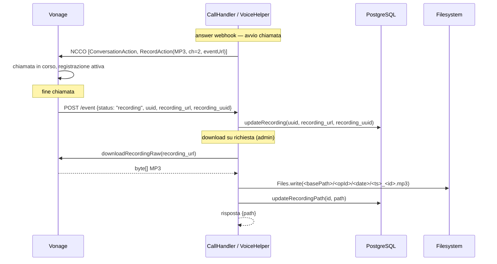

# WF-014 — Registrazione Audio delle Conversazioni

## Contesto

Ogni conversazione CTI avviene tramite una Vonage Named Conversation condivisa tra
operatore e cliente. Vonage supporta la registrazione automatica della conversazione
tramite l'azione NCCO `record`, che al termine della chiamata invia un evento webhook
con l'URL di download del file audio.

Il modulo implementa un flusso in due fasi:
1. **Acquisizione automatica** — l'URL di download viene salvato sul DB quando Vonage
   notifica il completamento della registrazione.
2. **Download su richiesta** — un admin scarica il file MP3 tramite API e lo archivia
   in storage locale.

---

## Flusso completo



---

## Fase 1 — NCCO e acquisizione URL

### NCCO generato da `buildOperatorNccoJson`

```json
[
  {
    "action": "conversation",
    "name": "call-<uuid>",
    "startOnEnter": false,
    "musicOnHoldUrl": ["<url>"]
  },
  {
    "action": "record",
    "format": "mp3",
    "channels": 2,
    "eventUrl": ["<cti.vonage.event_url>"]
  }
]
```

La `RecordAction` viene aggiunta solo se `cti.vonage.event_url` è configurato e non
vuoto. Con `channels: 2` Vonage registra i due partecipanti su canali stereo separati,
consentendo analisi audio differenziate (operatore su canale 1, cliente su canale 2).

### Evento `recording`

Quando la registrazione è disponibile, Vonage invia un `POST /event` con:

```json
{
  "status": "recording",
  "uuid": "<uuid-chiamata>",
  "recording_url": "https://api.nexmo.com/v1/files/<id>",
  "recording_uuid": "<recording-uuid>"
}
```

`VoiceHelper.processEvent` intercetta lo stato `recording` e chiama
`CallDAO.updateRecording(uuid, recordingUrl, recordingUuid)`.

---

## Fase 2 — Download e archiviazione

### Endpoint

`GET /api/cti/vonage/call/{id}/recording` — richiede ruolo `ADMIN`.

### Percorso di storage

```
<cti.vonage.recordings.path>/<operatoreId>/<YYYY-MM-DD>/<epochMillis>_<id>.mp3
```

Default: `/app/data/cti/recordings`.

Esempio: `/app/data/cti/recordings/3/2026-04-14/1713110400000_42.mp3`

Le directory vengono create automaticamente con `Files.createDirectories`.

### Risposta

```json
{ "err": false, "log": null, "out": { "path": "/app/data/cti/recordings/3/2026-04-14/..." } }
```

Errori gestiti:
- `404-business` (HTTP 200 `err: true`) se la chiamata non esiste
- `404-business` (HTTP 200 `err: true`) se `recording_url` è null (registrazione non disponibile)

---

## Implementazione

### Modifiche NCCO — `VoiceHelper.buildOperatorNccoJson`

Firma aggiornata: `buildOperatorNccoJson(String conversationName, String musicOnHoldUrl, String eventUrl)`.

La lista NCCO è ora `List<Object>` (era `List<Map<String,Object>>`) per consentire la
coesistenza di una `Map` manuale (ConversationAction) e di un oggetto `RecordAction`
del SDK. Jackson serializza entrambi correttamente.

### Evento recording — `VoiceHelper.processEvent`

Aggiunto ramo `"recording".equals(status)` che legge `recording_url` e `recording_uuid`
dal body del webhook e delega l'aggiornamento a `CallDAO.updateRecording`.

### Download — `CallHandler.downloadRecording`

Il metodo accede all'SDK Vonage tramite `VoiceHelper.downloadRecordingRaw(url)` —
wrapper sul metodo `VoiceClient.downloadRecordingRaw(url)` che restituisce `byte[]`.
L'accesso è mediato da `VoiceHelper` perché `vonageClient` è private a quella classe.

### Schema DB — `V20260414_170000__cti_recording.sql`

```sql
ALTER TABLE jms_cti_chiamate
  ADD COLUMN IF NOT EXISTS recording_url  VARCHAR(500),
  ADD COLUMN IF NOT EXISTS recording_uuid VARCHAR(64),
  ADD COLUMN IF NOT EXISTS recording_path VARCHAR(500);
```

| Colonna | Quando viene valorizzata |
|---|---|
| `recording_url` | All'evento `recording` da Vonage |
| `recording_uuid` | All'evento `recording` da Vonage |
| `recording_path` | Dopo il download tramite `GET /call/{id}/recording` |

### Metodi DAO aggiunti — `CallDAO`

| Metodo | Scopo |
|---|---|
| `findById(long id)` | Recupera la chiamata per `id` (usato da `downloadRecording`) |
| `updateRecording(uuid, url, recUuid)` | Salva URL e UUID della registrazione |
| `updateRecordingPath(id, path)` | Aggiorna il percorso locale dopo il download |

---

## Configurazione

| Proprietà | Default | Descrizione |
|---|---|---|
| `cti.vonage.event_url` | `""` | URL webhook Vonage per eventi Voice (inclusi `recording`) |
| `cti.vonage.recordings.path` | `/app/data/cti/recordings` | Directory base per i file MP3 archiviati |

Se `cti.vonage.event_url` è vuoto, l'azione `record` non viene inserita nell'NCCO e
nessuna registrazione viene avviata.

---

## Note operative

- Il file audio rimane disponibile sul CDN Vonage fino al download; dopo il download
  `recording_path` indica la copia locale.
- Il download è on-demand (non automatico): va attivato dall'admin per ogni chiamata
  che si intende archiviare.
- Le registrazioni MP3 stereo (2 canali) consentono strumenti di analisi vocale
  differenziati per operatore e cliente.
- La directory di storage deve essere scrivibile dall'utente che esegue il processo Java
  (`appuser` in produzione, UID 1001).
