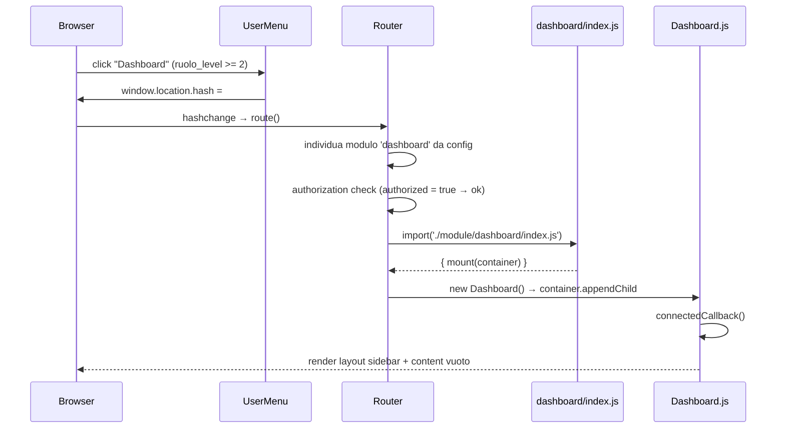

# WF-DASHBOARD-001-ACCESSO-DASHBOARD

### Accesso al dashboard

### Obiettivo

Consentire agli utenti con ruolo ADMIN+ di accedere al pannello dashboard tramite la voce dedicata nel menu utente dell'header. Il router SPA carica il modulo dashboard nel container `#main` e monta il componente `<dashboard-root>`, che presenta il layout a due colonne (sidebar + content).

### Attori

* Utente ADMIN o ROOT (`Browser`)
* Menu utente (`UserMenu` — componente header)
* Router SPA (`router.js`)
* Componente dashboard (`Dashboard.js` → `<dashboard-root>`)
* Componente sidebar (`Sidebar.js` → `<dashboard-sidebar>`)

### Precondizioni

* Utente autenticato con ruolo ADMIN+ (`ruolo_level >= 2`)
* Modulo dashboard installato e registrato in `config.js` con `route: '/dashboard'`
* Store `dashboardItems` popolato dalle init dei moduli installati

---

### Flusso principale

1. `UserMenu` renderizza la voce "Dashboard" nel dropdown solo se `user.ruolo_level >= 2`
2. Utente clicca "Dashboard" → hash diventa `#/dashboard`
3. `Router.route()` individua il modulo `dashboard` dalla configurazione
4. Verifica `authorization`: utente non autenticato → redirect a `redirectTo`; autenticato → prosegue
5. `Router.loadModule('dashboard')` importa `gui/src/module/dashboard/index.js`
6. `index.js` crea `<dashboard-root>` e lo appende al container `#main`
7. `Dashboard.connectedCallback()` non seleziona automaticamente alcuna voce (sidebar vuota al primo accesso)
8. `<dashboard-sidebar>` legge `dashboardItems` dallo store e filtra le voci per `minRuoloLevel`
9. L'area content `#dashboard-content` rimane vuota fino alla prima selezione dalla sidebar

### Flusso alternativo — Utente non autenticato

* Il router rileva `authorized = false` → redirect a `/user/auth/login`
* Alla route protetta viene salvato in `sessionStorage` il path `#/dashboard` per redirect post-login

---

### Postcondizioni

* Componente `<dashboard-root>` montato in `#main`
* Sidebar visualizzata con le voci visibili per il ruolo corrente
* Area content vuota in attesa di selezione

---

### Diagramma di sequenza — Accesso tramite menu utente

