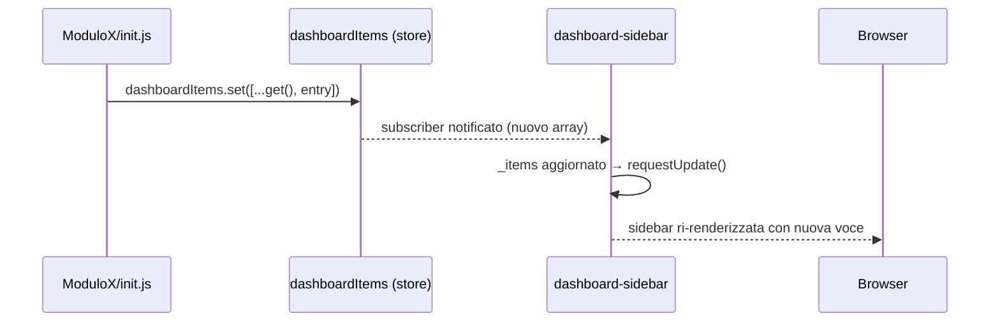
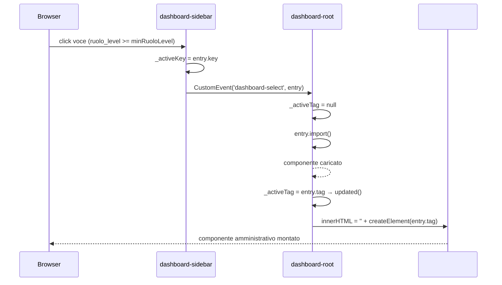

# WF-DASHBOARD-002-REGISTRAZIONE-VOCE-SIDEBAR

### Registrazione voce sidebar da un modulo esterno

### Obiettivo

Consentire a qualsiasi modulo installato che dispone di un'interfaccia amministrativa di aggiungere una voce alla sidebar del dashboard. La registrazione avviene tramite lo store condiviso `dashboardItems` nell'`init.js` del modulo. La sidebar legge lo store reattivamente e filtra le voci in base al ruolo dell'utente corrente.

### Attori

* Modulo esterno (`init.js` del modulo che si registra)
* Store condiviso (`dashboardItems` in `store.js`)
* Componente sidebar (`Sidebar.js` → `<dashboard-sidebar>`)
* Store utente (`user` in `store.js`)

### Precondizioni

* Store `dashboardItems` inizializzato come atom vuoto in `store.js`
* Il modulo esterno esegue la registrazione nella propria `init()`, prima del primo routing
* `<dashboard-sidebar>` è montato e sottoscritto allo store

---

### Flusso — Registrazione (init del modulo esterno)

1. Il router esegue tutte le `init()` dei moduli in parallelo prima del primo routing
2. `init()` del modulo esterno chiama `dashboardItems.set([...dashboardItems.get(), entry])`
3. La voce ha forma `{ key, label, icon, tag, import, minRuoloLevel }`:
   * `key` — identificatore univoco della voce
   * `label` — testo visualizzato nella sidebar
   * `icon` — classe Bootstrap Icon (es. `bi-people`)
   * `tag` — nome del custom element da montare nel content (es. `user-admin-users`)
   * `import` — funzione lazy `() => import('./path/to/Component.js')`
   * `minRuoloLevel` — livello minimo richiesto (1=user, 2=admin, 3=root; default 0)

### Flusso — Selezione voce dalla sidebar

1. `<dashboard-sidebar>` filtra `dashboardItems` confrontando `minRuoloLevel` con `user.get()?.ruolo_level`
2. Utente clicca una voce → `Sidebar` emette `CustomEvent('dashboard-select', { detail: entry })`
3. `Dashboard._onSelect(e)` riceve l'evento:
   * Imposta `_activeTag = null` (svuota il content durante il caricamento)
   * Chiama `entry.import()` → lazy import del file del componente
   * Al completamento: `_activeTag = entry.tag`
4. `Dashboard.updated()` rileva il cambio di `_activeTag`:
   * Se `_currentTag === _activeTag` → nessuna operazione (idempotente)
   * Altrimenti: svuota `#dashboard-content`, crea e appende `document.createElement(entry.tag)`
5. Il custom element è ora montato nell'area content

---

### Postcondizioni

* **Registrazione**: voce presente in `dashboardItems`; la sidebar la mostra ai ruoli abilitati
* **Selezione**: custom element del modulo montato in `#dashboard-content`; selezioni successive dello stesso item non rimontano il componente

---

### Schema voce sidebar

```
{
  key:           string,       // es. 'user-admin'
  label:         string,       // es. 'Gestione utenti'
  icon:          string,       // es. 'bi-people'
  tag:           string,       // es. 'user-admin-users'
  import:        () => Promise // es. () => import('./admin/Users.js')
  minRuoloLevel: number        // es. 2
}
```

---

### Diagramma di sequenza — Registrazione



### Diagramma di sequenza — Selezione voce


