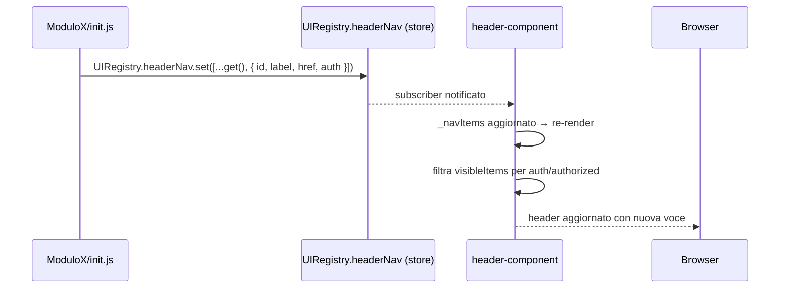
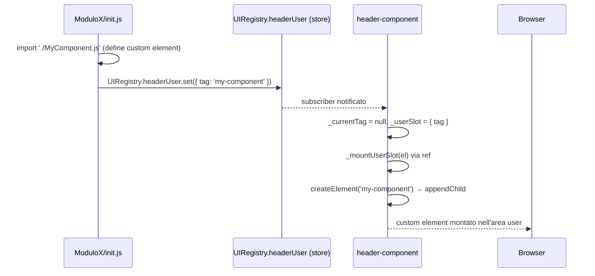
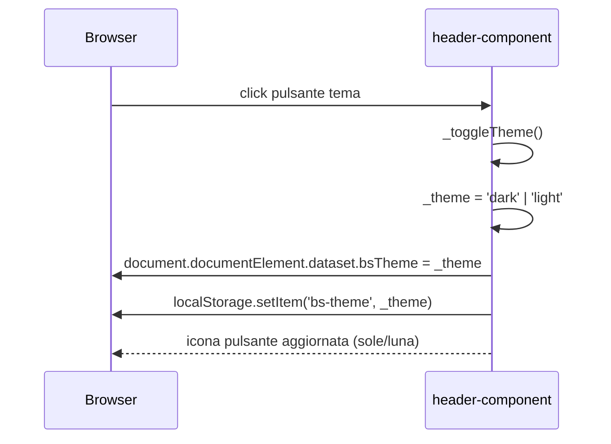

# WF-HEADER-001-REGISTRAZIONE-NAV-ITEMS

### Registrazione voci di navigazione e slot user

### Obiettivo

Consentire ai moduli installati di aggiungere voci di navigazione nell'area link dell'header e di occupare lo slot user (area destra) con un proprio custom element. La registrazione avviene tramite gli store condivisi `UIRegistry.headerNav` e `UIRegistry.headerUser` nell'`init.js` di ciascun modulo. Il componente `<header-component>` reagisce reattivamente alle variazioni degli store.

### Attori

* Modulo esterno (`init.js` del modulo che si registra)
* Registro condiviso (`UIRegistry` in `store.js`)
* Componente header (`Header.js` → `<header-component>`)

### Precondizioni

* `UIRegistry.headerNav` e `UIRegistry.headerUser` inizializzati in `store.js`
* `<header-component>` già montato come modulo persistent prima dell'esecuzione delle `init()`

---

### Flusso — Registrazione voce nell'area link

1. Il router esegue tutte le `init()` dei moduli in parallelo prima del primo routing
2. `init()` del modulo chiama `UIRegistry.headerNav.set([...UIRegistry.headerNav.get(), item])`
3. La voce ha forma `{ id, label, href, auth }` oppure con sottovoci `{ id, label, auth, items: [{ label, href }] }`:
   * `auth: false` — sempre visibile
   * `auth: true` — visibile solo se `authorized = true`
4. `<header-component>` riceve la notifica dallo store → `_navItems` aggiornato → re-render
5. `render()` filtra: `visibleItems = _navItems.filter(item => !item.auth || _authorized)`
6. Voci senza `items` renderizzate come link semplice; voci con `items` come dropdown

### Flusso — Registrazione slot user

1. `init()` del modulo chiama `UIRegistry.headerUser.set({ tag: 'nome-custom-element' })`
2. Il custom element deve essere già definito (importato nello stesso `init.js`)
3. `<header-component>` riceve la notifica → `_userSlot` aggiornato, `_currentTag` azzerato
4. `_mountUserSlot(el)` crea e appende `document.createElement(tag)` nel wrapper `ref`
5. Chiamate successive con lo stesso tag sono idempotenti (check `_currentTag === tag`)

### Flusso — Cambio tema

1. Utente clicca il pulsante tema → `_toggleTheme()`
2. Alterna `_theme` tra `'light'` e `'dark'`
3. Imposta `document.documentElement.dataset.bsTheme` → Bootstrap cambia tema globalmente
4. Persiste la scelta in `localStorage` con chiave `'bs-theme'`
5. Al montaggio (`connectedCallback`) il tema salvato viene ripristinato

---

### Postcondizioni

* **Voce link**: presente in `UIRegistry.headerNav`; visibile in base al valore di `auth` e allo stato di autenticazione
* **Slot user**: custom element montato nell'area destra dell'header; un solo modulo alla volta può occupare lo slot (l'ultimo che chiama `set` vince)
* **Tema**: persistito in `localStorage`; ripristinato ad ogni montaggio dell'header

---

### Schema voce area link

```
// Link semplice
{ id: string, label: string, href: string, auth: boolean }

// Dropdown
{ id: string, label: string, auth: boolean, items: Array<{ label: string, href: string }> }
```

### Schema slot user

```
{ tag: string }   // es. { tag: 'user-menu' }
```

---

### Diagramma di sequenza — Registrazione voce link



### Diagramma di sequenza — Registrazione slot user



### Diagramma di sequenza — Cambio tema


