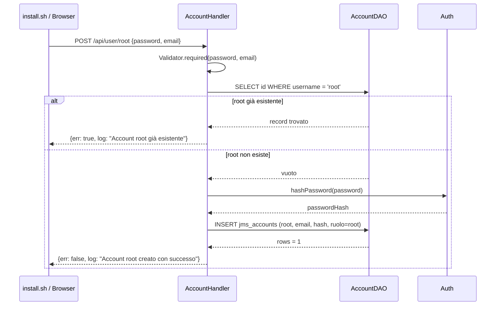

# WF-USER-001-BOOTSTRAP-ROOT

### Bootstrap account root

### Obiettivo

Creare l'account root del sistema. Operazione una tantum: se l'account root esiste già la richiesta viene rifiutata. Non richiede autenticazione. Eseguita tipicamente dallo script di post-install del modulo.

### Attori

* Client (`install.sh` o browser non autenticato)
* Handler account (`AccountHandler.createRoot`)
* DAO account (`AccountDAO`)

### Precondizioni

* Nessun account con username `root` presente in `jms_accounts`

---

### Flusso principale

1. Client invia `POST /api/user/root` con `{password, email}`
2. `AccountHandler.createRoot` valida che `password` ed `email` siano presenti
3. `AccountDAO` esegue `SELECT id FROM jms_accounts WHERE username = 'root'`
4. Se il record esiste → risposta `{err: true, log: "Account root già esistente"}`
5. `Auth.hashPassword(password)` produce l'hash PBKDF2
6. `INSERT INTO jms_accounts (username, email, password_hash, ruolo, must_change_password) VALUES ('root', ?, ?, 'root', false)`
7. Risposta: `{err: false, log: "Account root creato con successo"}`

---

### Postcondizioni

* Un solo account con `username = 'root'` e `ruolo = 'root'` presente nel sistema
* Account attivo (`attivo = true`) e senza obbligo di cambio password

---

### Diagramma di sequenza

