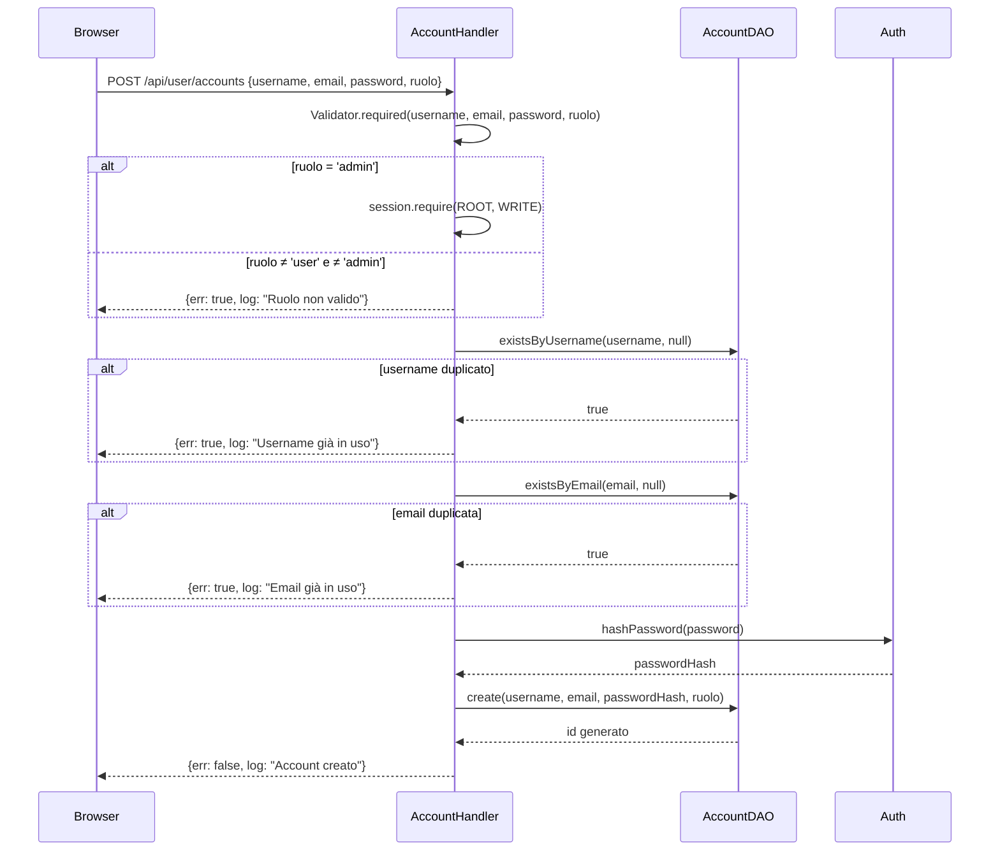

# WF-USER-002-CREAZIONE-ACCOUNT

### Creazione account

### Obiettivo

Creare un nuovo account nel sistema. Il ruolo da assegnare determina il livello di autorizzazione richiesto al chiamante: la creazione di account `user` è libera (self-registration), la creazione di account `admin` richiede il ruolo `root`. La creazione dell'account `root` è riservata all'endpoint dedicato (WF-USER-001).

### Attori

* Utente non autenticato o autenticato (`Browser`)
* Handler account (`AccountHandler.register`)
* DAO account (`AccountDAO`)
* `Auth`

### Precondizioni

* Per ruolo `user`: nessuna autenticazione richiesta
* Per ruolo `admin`: chiamante autenticato con ruolo `root`

---

### Flusso principale

1. Browser invia `POST /api/user/accounts` con `{username, email, password, ruolo}`
2. `AccountHandler.register` valida che tutti i campi siano presenti
3. Se `ruolo = 'admin'` → `session.require(ROOT, WRITE)`; se `ruolo ≠ 'user'` e `≠ 'admin'` → errore ruolo non valido
4. `AccountDAO.existsByUsername(username, null)` → se duplicato, errore `"Username già in uso"`
5. `AccountDAO.existsByEmail(email, null)` → se duplicato, errore `"Email già in uso"`
6. `Auth.hashPassword(password)` produce l'hash PBKDF2
7. `AccountDAO.create(username, email, passwordHash, ruolo)` → `INSERT` con `must_change_password = false`
8. Risposta: `{err: false, log: "Account creato"}`

---

### Postcondizioni

* Account presente in `jms_accounts` con `attivo = true`
* Profilo (`jms_users`) non ancora creato — viene creato separatamente (WF-USER-010)

---

### Diagramma di sequenza

