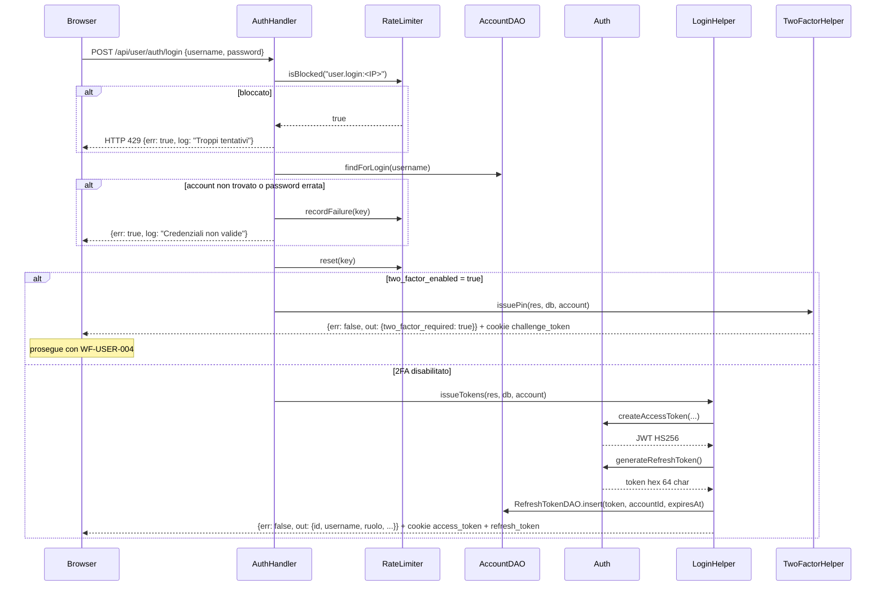

# WF-USER-003-LOGIN

### Login con username e password

### Obiettivo

Autenticare un utente tramite username e password. Se l'account ha il two-factor abilitato, il login non si completa qui ma prosegue con WF-USER-004. In caso di successo vengono emessi access token e refresh token come cookie `HttpOnly`.

### Attori

* Utente (`Browser`)
* Handler auth (`AuthHandler.login`)
* Adapter (`LoginCredentialAdapter`)
* DAO account (`AccountDAO`)
* `Auth`, `RateLimiter`
* Helper login (`LoginHelper.issueTokens`)
* Helper 2FA (`TwoFactorHelper.issuePin`)

### Precondizioni

* Account esistente con `attivo = true`
* IP non bloccato dal rate limiter (`user.login:<IP>`)

---

### Flusso principale

1. Browser invia `POST /api/user/auth/login` con `{username, password}`
2. `LoginCredentialAdapter.from(req)` estrae le credenziali
3. `RateLimiter.isBlocked("user.login:<IP>")` → se bloccato, risposta HTTP 429
4. `AccountDAO.findForLogin(username)` → recupera account con hash e flag 2FA
5. Se account non trovato o `Auth.checkPassword(password, hash)` fallisce:
   * `RateLimiter.recordFailure(key)` registra il tentativo fallito
   * Risposta: `{err: true, log: "Credenziali non valide"}`
6. `RateLimiter.reset(key)` annulla i tentativi precedenti
7. Se `two_factor_enabled = true` → `TwoFactorHelper.issuePin(res, db, account)` (→ WF-USER-004)
8. Altrimenti → `LoginHelper.issueTokens(res, db, account)`:
   * Genera access token JWT HS256 (scadenza 15 min) con claim `sub`, `username`, `ruolo`, `ruolo_level`, `must_change_password`, `jti`
   * Genera refresh token (64 char hex, scadenza 7 giorni)
   * `RefreshTokenDAO.insert(token, accountId, expiresAt)`
   * Imposta cookie `access_token` (15 min) e `refresh_token` (7 giorni)
   * Risposta: `{err: false, out: {id, username, ruolo, ruolo_level, must_change_password}}`

### Flusso alternativo — 2FA abilitato

Dopo il punto 6, se `two_factor_enabled = true` il controllo passa a `TwoFactorHelper.issuePin`: il login non viene completato e il browser deve proseguire con WF-USER-004.

---

### Postcondizioni (login completato senza 2FA)

* Cookie `access_token` e `refresh_token` impostati
* Record in `jms_refresh_tokens` per la sessione corrente
* Rate limiter resettato per l'IP

---

### Diagramma di sequenza

