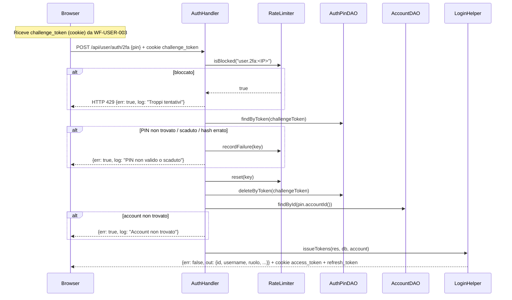

# WF-USER-004-TWO-FACTOR

### Autenticazione two-factor (2FA)

### Obiettivo

Completare il login per gli account con `two_factor_enabled = true`. Dopo che WF-USER-003 ha generato e inviato il PIN via email, l'utente lo inserisce per ottenere i token di sessione.

### Attori

* Utente (`Browser`)
* Handler auth (`AuthHandler.twoFactor`)
* Adapter (`TwoFactorCredentialAdapter`)
* DAO PIN (`AuthPinDAO`)
* DAO account (`AccountDAO`)
* `Auth`, `RateLimiter`
* Helper login (`LoginHelper.issueTokens`)

### Precondizioni

* Login completato fino al punto 2FA (WF-USER-003)
* Cookie `challenge_token` presente nel browser
* Record valido in `jms_auth_pins` (scadenza 10 minuti)
* IP non bloccato dal rate limiter (`user.2fa:<IP>`)

---

### Flusso di emissione PIN (in carico a WF-USER-003)

`TwoFactorHelper.issuePin`:

1. Genera PIN numerico casuale con `Auth.generatePin()`
2. Hash del PIN con `Auth.hashPassword(pin)`
3. Genera `challengeToken` (64 char hex)
4. `AuthPinDAO.cleanup(accountId)` elimina PIN precedenti per lo stesso account
5. `AuthPinDAO.insert(challengeToken, accountId, pinHash, expiresAt = NOW()+10min)`
6. Invia email con il PIN all'indirizzo dell'account
7. Risponde con `{two_factor_required: true}` + cookie `challenge_token` (10 min)

---

### Flusso principale — Verifica PIN

1. Browser invia `POST /api/user/auth/2fa` con `{challenge_token, pin}` (il `challenge_token` è anche nel cookie)
2. `TwoFactorCredentialAdapter.from(req)` estrae le credenziali
3. `RateLimiter.isBlocked("user.2fa:<IP>")` → se bloccato, risposta HTTP 429
4. `AuthPinDAO.findByToken(challengeToken)` → recupera il record PIN
5. Se PIN non trovato, scaduto (`LocalDateTime.now().isAfter(pin.expiresAt())`) o hash non corrisponde:
   * `RateLimiter.recordFailure(key)` registra il fallimento
   * Risposta: `{err: true, log: "PIN non valido o scaduto"}`
6. `RateLimiter.reset(key)` annulla i tentativi precedenti
7. `AuthPinDAO.deleteByToken(challengeToken)` consuma il PIN (one-time)
8. `AccountDAO.findById(pin.accountId())` → recupera dati account per i claim
9. Se account non trovato → errore `"Account non trovato"`
10. `LoginHelper.issueTokens(res, db, account)` → emette access token e refresh token (stesso flusso di WF-USER-003 punto 8)

---

### Postcondizioni

* Cookie `access_token` e `refresh_token` impostati
* Record PIN eliminato da `jms_auth_pins`
* Record in `jms_refresh_tokens` per la sessione corrente

---

### Diagramma di sequenza

