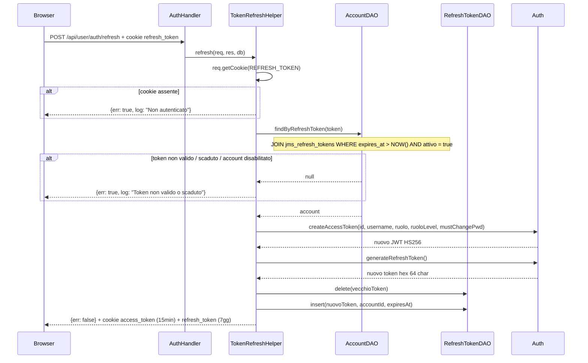

# WF-USER-005-RINNOVO-TOKEN

### Rinnovo access token (token refresh)

### Obiettivo

Rinnovare l'access token scaduto senza richiedere nuovamente le credenziali. Il refresh token viene ruotato ad ogni rinnovo (token rotation): il vecchio viene eliminato e uno nuovo viene emesso con nuova scadenza.

### Attori

* Client (`Browser` o `init.js` — fetch interceptor)
* Handler auth (`AuthHandler.refresh`)
* Helper (`TokenRefreshHelper.refresh`)
* DAO account (`AccountDAO`)
* DAO refresh token (`RefreshTokenDAO`)
* `Auth`

### Precondizioni

* Cookie `refresh_token` presente nel browser
* Token valido in `jms_refresh_tokens` (non scaduto, account attivo)

---

### Flusso principale

1. Browser invia `POST /api/user/auth/refresh` (tipicamente scatenato dall'interceptor in `init.js` su risposta con `err: true` e messaggio di non autenticazione)
2. `TokenRefreshHelper.refresh` legge il cookie `refresh_token`
3. Se cookie assente → risposta `{err: true, log: "Non autenticato"}`
4. `AccountDAO.findByRefreshToken(token)` → `JOIN jms_refresh_tokens` con controllo `expires_at > NOW()` e `attivo = true`
5. Se token non trovato / scaduto / account disabilitato → risposta `{err: true, log: "Token non valido o scaduto"}`
6. Genera nuovo access token JWT con `Auth.createAccessToken(...)`
7. Genera nuovo refresh token con `Auth.generateRefreshToken()`
8. `RefreshTokenDAO.delete(vecchioToken)` — elimina il token usato
9. `RefreshTokenDAO.insert(nuovoToken, accountId, expiresAt)` — registra il nuovo token
10. Imposta cookie `access_token` (15 min) e `refresh_token` (7 giorni)
11. Risposta: `{err: false, out: null}`

---

### Postcondizioni

* Nuovo access token emesso (15 min)
* Vecchio refresh token eliminato, nuovo registrato (7 giorni)
* Sessione utente rinnovata in modo trasparente

---

### Diagramma di sequenza

