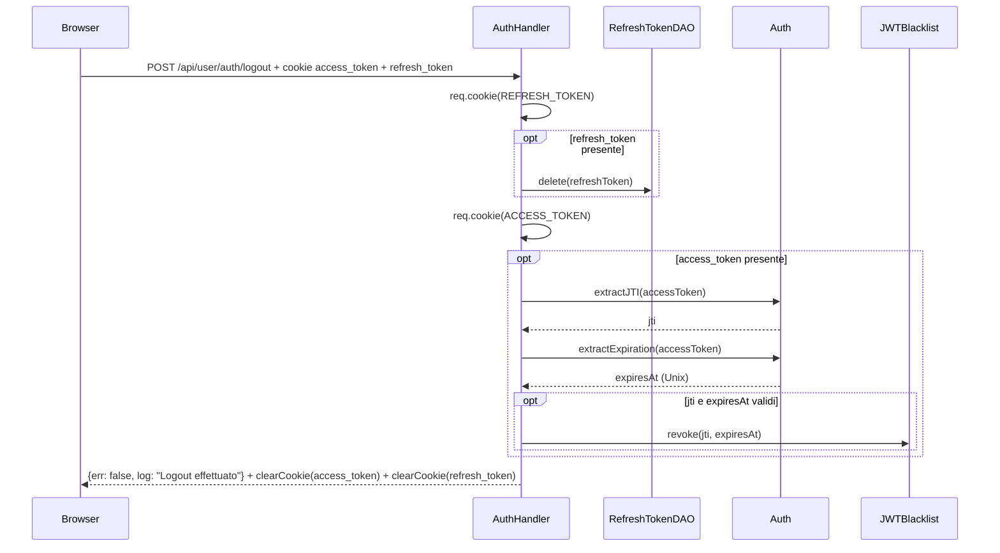

# WF-USER-006-LOGOUT

### Logout

### Obiettivo

Terminare la sessione dell'utente: revocare il refresh token dal database e aggiungere l'access token alla blacklist in memoria per impedirne il riutilizzo fino alla scadenza naturale.

### Attori

* Utente (`Browser`)
* Handler auth (`AuthHandler.logout`)
* DAO refresh token (`RefreshTokenDAO`)
* `Auth`, `JWTBlacklist`

### Precondizioni

* Cookie `refresh_token` e/o `access_token` presenti nel browser

---

### Flusso principale

1. Browser invia `POST /api/user/auth/logout`
2. Legge cookie `refresh_token`; se presente → `RefreshTokenDAO.delete(refreshToken)` elimina il record dal DB
3. Legge cookie `access_token`; se presente:
   * `Auth.get().extractJTI(accessToken)` estrae il JWT ID (`jti`)
   * `Auth.get().extractExpiration(accessToken)` estrae la scadenza Unix
   * Se entrambi validi → `JWTBlacklist.revoke(jti, expiresAt)` aggiunge il token alla blacklist in memoria (TTL = scadenza naturale)
4. `res.clearCookie(ACCESS_TOKEN)` e `res.clearCookie(REFRESH_TOKEN)` azzerano i cookie lato client
5. Risposta: `{err: false, log: "Logout effettuato"}`

---

### Postcondizioni

* Refresh token eliminato da `jms_refresh_tokens`
* Access token revocato in `JWTBlacklist` fino alla scadenza naturale
* Cookie `access_token` e `refresh_token` azzerati nel browser (`maxAge = 0`)

---

### Diagramma di sequenza

