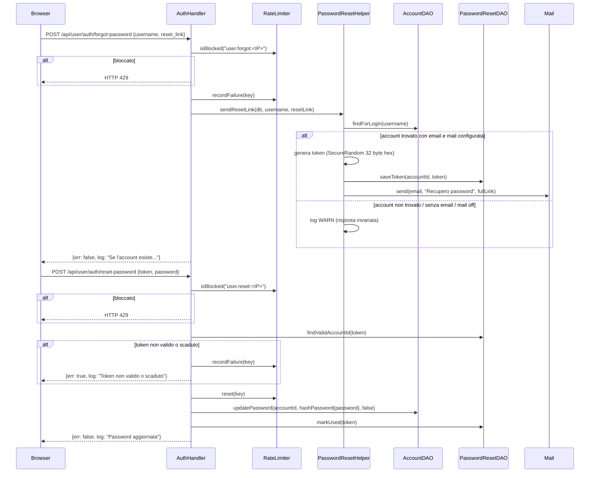

# WF-USER-007-RESET-PASSWORD

### Reset password via email

### Obiettivo

Permettere a un utente che ha dimenticato la password di reimpostarla tramite un link inviato via email. Il flusso è in due fasi: richiesta del link e utilizzo del token one-time. La risposta alla richiesta è sempre neutra per prevenire user enumeration.

### Attori

* Utente (`Browser`)
* Handler auth (`AuthHandler.forgotPassword`, `AuthHandler.resetPassword`)
* Adapter (`ForgotPasswordAdapter`, `ResetPasswordAdapter`)
* Helper reset (`PasswordResetHelper.sendResetLink`)
* DAO reset (`PasswordResetDAO`)
* DAO account (`AccountDAO`)
* `Auth`, `RateLimiter`, `Mail`

### Precondizioni

* **Fase 1**: IP non bloccato dal rate limiter (`user.forgot:<IP>`)
* **Fase 2**: Token valido e non utilizzato in `jms_password_reset_tokens`; IP non bloccato (`user.reset:<IP>`)
* Mail configurata (`mail.enabled = true`) per l'invio del link

---

### Flusso principale — Fase 1: Richiesta link

1. Browser invia `POST /api/user/auth/forgot-password` con `{username, reset_link}`
2. `ForgotPasswordAdapter.from(req)` estrae i dati
3. `RateLimiter.isBlocked("user.forgot:<IP>")` → se bloccato, risposta HTTP 429
4. `RateLimiter.recordFailure(key)` (registra sempre per limitare abusi)
5. `PasswordResetHelper.sendResetLink(db, username, resetLink)`:
   * `AccountDAO.findForLogin(username)` → cerca l'account
   * Se account non trovato, senza email, o mail non configurata: log WARN, nessuna email inviata
   * Altrimenti: genera token hex 32 byte, calcola `fullLink = resetLink + "?token=" + token`
   * `PasswordResetDAO.saveToken(accountId, token)` → INSERT con `expires_at = NOW() + 1h`, `used = false`
   * `Mail.send(email, "Recupero password", fullLink)`
6. Risposta neutra: `{err: false, log: "Se l'account esiste, riceverai un'email con il link di reset"}`

### Flusso principale — Fase 2: Reset con token

1. Browser invia `POST /api/user/auth/reset-password` con `{token, password}` (token estratto dalla query string del link)
2. `ResetPasswordAdapter.from(req)` estrae i dati
3. `RateLimiter.isBlocked("user.reset:<IP>")` → se bloccato, risposta HTTP 429
4. `PasswordResetDAO.findValidAccountId(token)` → cerca token non scaduto e non usato
5. Se non trovato:
   * `RateLimiter.recordFailure(key)`
   * Risposta: `{err: true, log: "Token non valido o scaduto"}`
6. `RateLimiter.reset(key)`
7. `AccountDAO.updatePassword(accountId, Auth.hashPassword(password), mustChangePassword = false)`
8. `PasswordResetDAO.markUsed(token)` → imposta `used = true` (token non riutilizzabile)
9. Risposta: `{err: false, log: "Password aggiornata"}`

---

### Postcondizioni

* **Fase 1**: Token one-time registrato in `jms_password_reset_tokens` (scadenza 1h)
* **Fase 2**: Password aggiornata con nuovo hash; token marcato `used = true`

---

### Diagramma di sequenza

