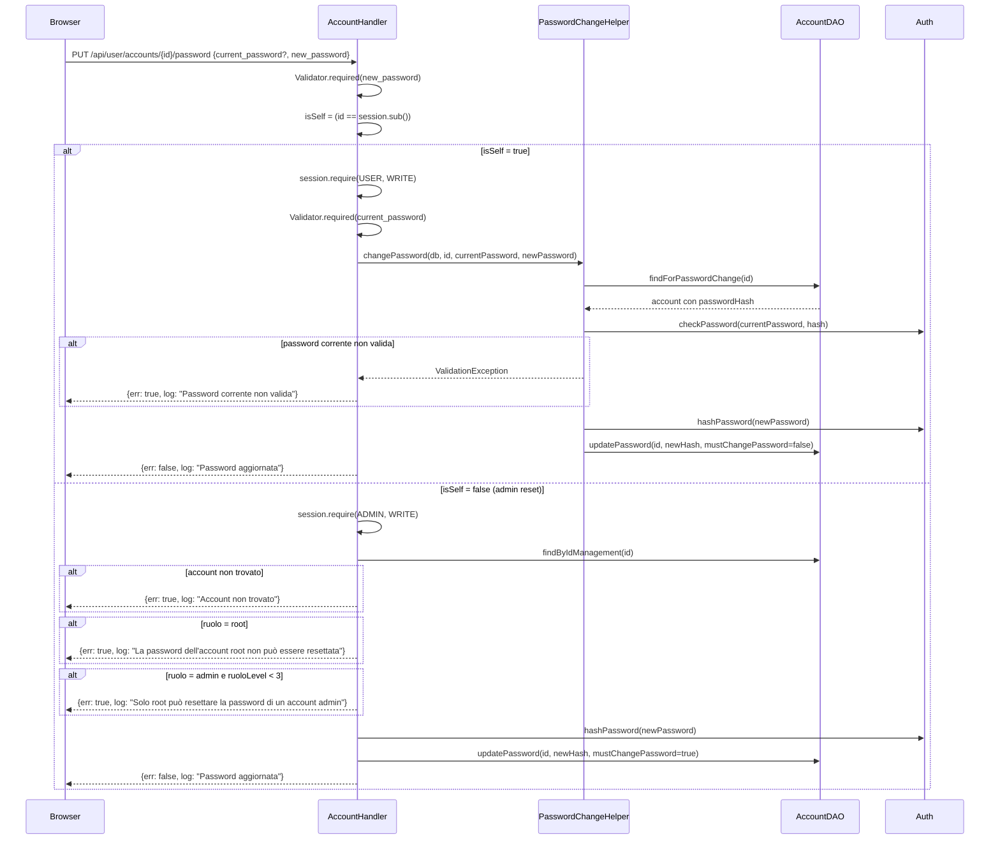

# WF-USER-008-CAMBIO-PASSWORD

### Cambio password

### Obiettivo

Aggiornare la password di un account. Il comportamento varia in base a chi chiama: l'utente autenticato deve fornire la password corrente per la verifica; un admin può resettare la password di qualunque account sotto di sé senza conoscere quella attuale, impostando automaticamente `must_change_password = true`.

### Attori

* Utente o Admin (`Browser`)
* Handler account (`AccountHandler.changePassword`)
* Helper cambio password (`PasswordChangeHelper`)
* DAO account (`AccountDAO`)
* `Auth`

### Precondizioni

* Utente autenticato (USER+ per self, ADMIN+ per altri account)
* Per la variante self: `{id}` nell'URL corrisponde al `sub` del JWT

---

### Flusso principale — Self (id == session.sub)

1. Browser invia `PUT /api/user/accounts/{id}/password` con `{current_password, new_password}`
2. `AccountHandler.changePassword` valida `new_password` obbligatorio
3. Rileva `isSelf = (id == session.sub())`; richiede `session.require(USER, WRITE)`
4. Valida `current_password` obbligatorio
5. `PasswordChangeHelper.changePassword(db, id, currentPassword, newPassword)`:
   * `AccountDAO.findForPasswordChange(id)` → recupera hash corrente
   * `Auth.checkPassword(currentPassword, hash)` → se non corrisponde, lancia `ValidationException("Password corrente non valida")`
   * `Auth.hashPassword(newPassword)` → nuovo hash
   * `AccountDAO.updatePassword(id, newHash, mustChangePassword = false)`
6. Risposta: `{err: false, log: "Password aggiornata"}`

### Flusso alternativo — Admin reset (id ≠ session.sub)

1. Browser invia `PUT /api/user/accounts/{id}/password` con `{new_password}`
2. `AccountHandler.changePassword` richiede `session.require(ADMIN, WRITE)`
3. `AccountDAO.findByIdManagement(id)` → verifica che l'account esista
4. Se `ruolo = 'root'` → errore `"La password dell'account root non può essere resettata"`
5. Se `ruolo = 'admin'` e `session.ruoloLevel() < 3` → errore `"Solo root può resettare la password di un account admin"`
6. `AccountDAO.updatePassword(id, Auth.hashPassword(newPassword), mustChangePassword = true)`
7. Risposta: `{err: false, log: "Password aggiornata"}`

---

### Postcondizioni

* Hash password aggiornato in `jms_accounts`
* **Self**: `must_change_password = false` (cambio volontario)
* **Admin reset**: `must_change_password = true` (l'utente dovrà cambiarla al prossimo accesso)

---

### Diagramma di sequenza

