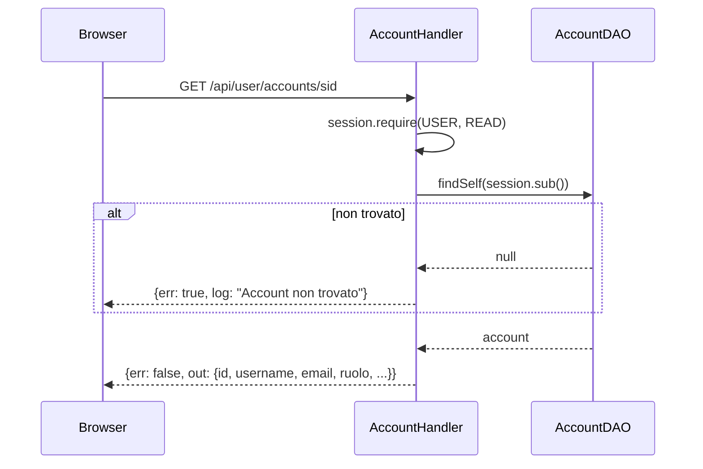
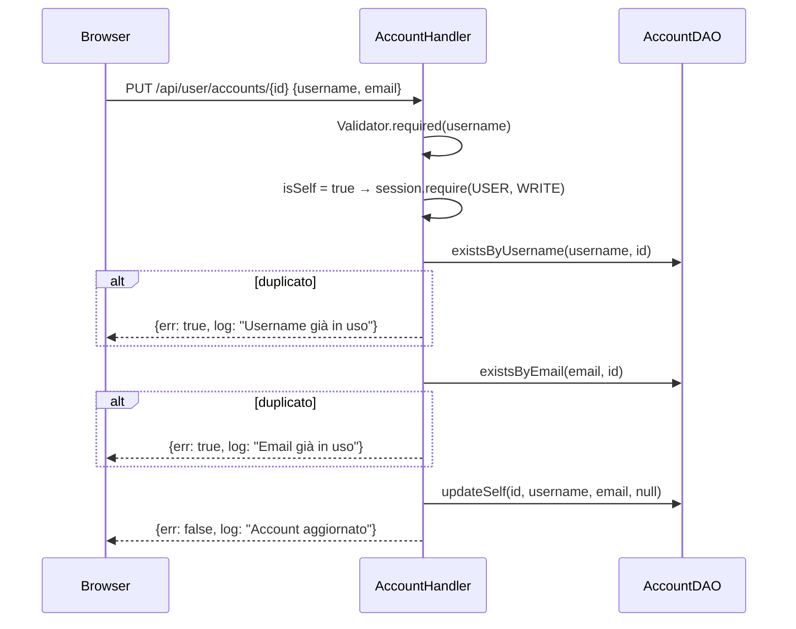
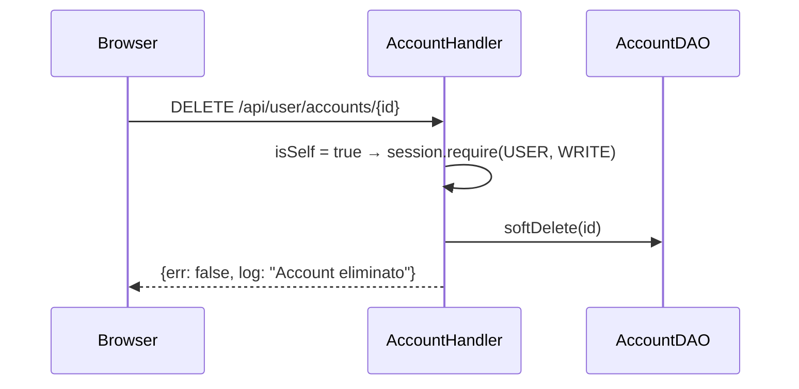

# WF-USER-009-GESTIONE-ACCOUNT-SELF

### Gestione account (self)

### Obiettivo

Consentire all'utente autenticato di consultare, aggiornare e disattivare il proprio account. L'aggiornamento è limitato a username ed email; ruolo e stato non sono modificabili dall'utente stesso.

### Attori

* Utente autenticato (`Browser`)
* Handler account (`AccountHandler.sid`, `AccountHandler.update`, `AccountHandler.delete`)
* DAO account (`AccountDAO`)

### Precondizioni

* Utente autenticato con ruolo USER+
* `{id}` nell'URL corrisponde al `sub` del JWT (controllo `isSelf`)

---

### Flusso — Lettura account

1. Browser invia `GET /api/user/accounts/sid`
2. `AccountHandler.sid` richiede `session.require(USER, READ)`
3. `AccountDAO.findSelf(session.sub())` → `SELECT id, username, email, ruolo, attivo, must_change_password, created_at WHERE id = ?`
4. Se non trovato → errore `"Account non trovato"`
5. Risposta: `{err: false, out: {id, username, email, ruolo, attivo, must_change_password, created_at}}`

### Flusso — Aggiornamento account

1. Browser invia `PUT /api/user/accounts/{id}` con `{username, email}`
2. `AccountHandler.update` valida `username` obbligatorio
3. Rileva `isSelf = true` → `session.require(USER, WRITE)`
4. `AccountDAO.existsByUsername(username, id)` → se duplicato, errore `"Username già in uso"`
5. `AccountDAO.existsByEmail(email, id)` → se duplicato, errore `"Email già in uso"`
6. `AccountDAO.updateSelf(id, username, email, null)` → `UPDATE SET username=?, email=?`
7. Risposta: `{err: false, log: "Account aggiornato"}`

### Flusso — Disattivazione account

1. Browser invia `DELETE /api/user/accounts/{id}`
2. `AccountHandler.delete` rileva `isSelf = true` → `session.require(USER, WRITE)`
3. `AccountDAO.softDelete(id)` → `UPDATE SET attivo = false`
4. Risposta: `{err: false, log: "Account eliminato"}`

---

### Postcondizioni

* **Aggiornamento**: `username` e `email` aggiornati in `jms_accounts`
* **Disattivazione**: `attivo = false`; i refresh token esistenti rimangono ma il login e il refresh saranno rifiutati

---

### Diagramma di sequenza — Lettura account

### Diagramma di sequenza — Aggiornamento account

### Diagramma di sequenza — Disattivazione account

