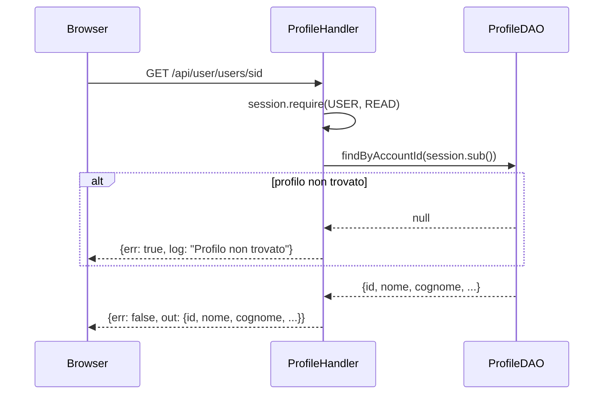
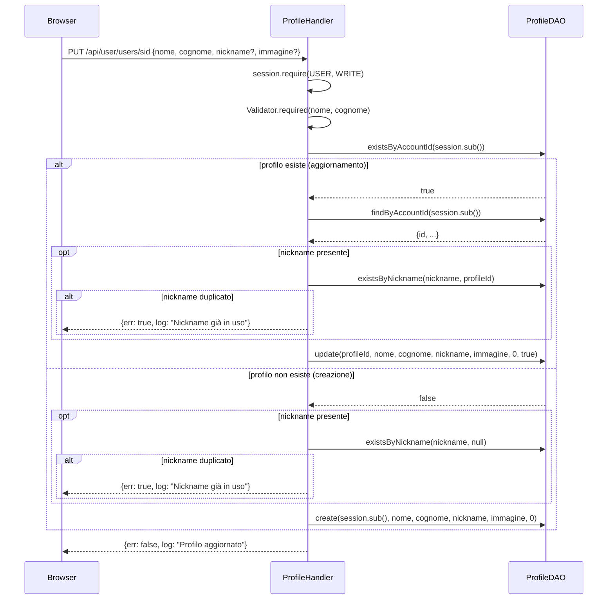

# WF-USER-010-GESTIONE-PROFILO

### Gestione profilo utente

### Obiettivo

Consentire all'utente autenticato di consultare e aggiornare i propri dati anagrafici (nome, cognome, nickname, immagine). Il profilo è separato dall'account: un account può esistere senza profilo; il profilo viene creato al primo salvataggio.

### Attori

* Utente autenticato (`Browser`)
* Handler profilo (`ProfileHandler.sid`, `ProfileHandler.update`)
* DAO profilo (`ProfileDAO`)

### Precondizioni

* Utente autenticato con ruolo USER+

---

### Flusso — Lettura profilo

1. Browser invia `GET /api/user/users/sid`
2. `ProfileHandler.sid` richiede `session.require(USER, READ)`
3. `ProfileDAO.findByAccountId(session.sub())` → `SELECT ... FROM jms_users WHERE account_id = ?`
4. Se non trovato → errore `"Profilo non trovato"` (profilo non ancora creato)
5. Risposta: `{err: false, out: {id, account_id, nome, cognome, nickname, immagine, created_at}}`

### Flusso — Creazione o aggiornamento profilo

1. Browser invia `PUT /api/user/users/sid` con `{nome, cognome, nickname?, immagine?}`
2. `ProfileHandler.update` richiede `session.require(USER, WRITE)`
3. Valida `nome` e `cognome` obbligatori
4. `ProfileDAO.existsByAccountId(session.sub())` → verifica se il profilo esiste già

   **Percorso A — Aggiornamento (profilo esiste)**
   * `ProfileDAO.findByAccountId(session.sub())` → recupera `id` del profilo
   * Se `nickname` presente e non vuoto: `ProfileDAO.existsByNickname(nickname, profileId)` → se duplicato, errore `"Nickname già in uso"`
   * `ProfileDAO.update(profileId, nome, cognome, nickname, immagine, flags=0, attivo=true)`

   **Percorso B — Creazione (profilo non esiste)**
   * Se `nickname` presente e non vuoto: `ProfileDAO.existsByNickname(nickname, null)` → se duplicato, errore `"Nickname già in uso"`
   * `ProfileDAO.create(session.sub(), nome, cognome, nickname, immagine, flags=0)`

5. Risposta: `{err: false, log: "Profilo aggiornato"}`

---

### Postcondizioni

* Record in `jms_users` creato o aggiornato
* `nickname` unico nel sistema se valorizzato

---

### Diagramma di sequenza — Lettura profilo

### Diagramma di sequenza — Creazione/Aggiornamento profilo

