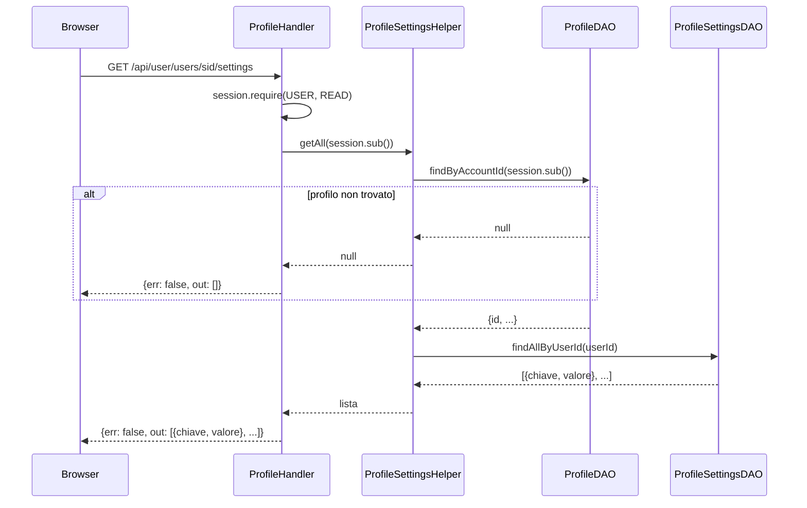
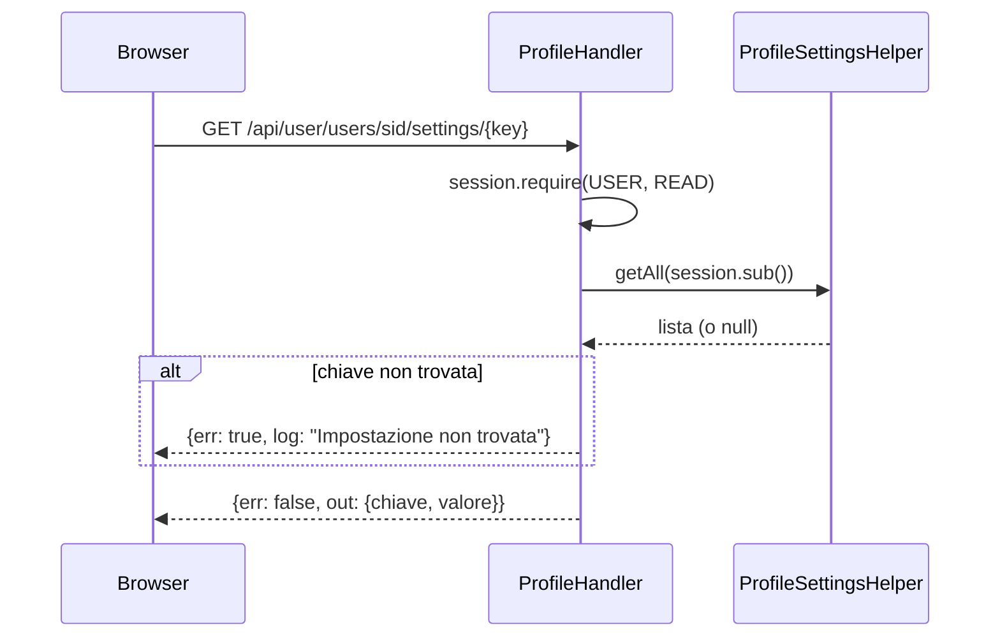
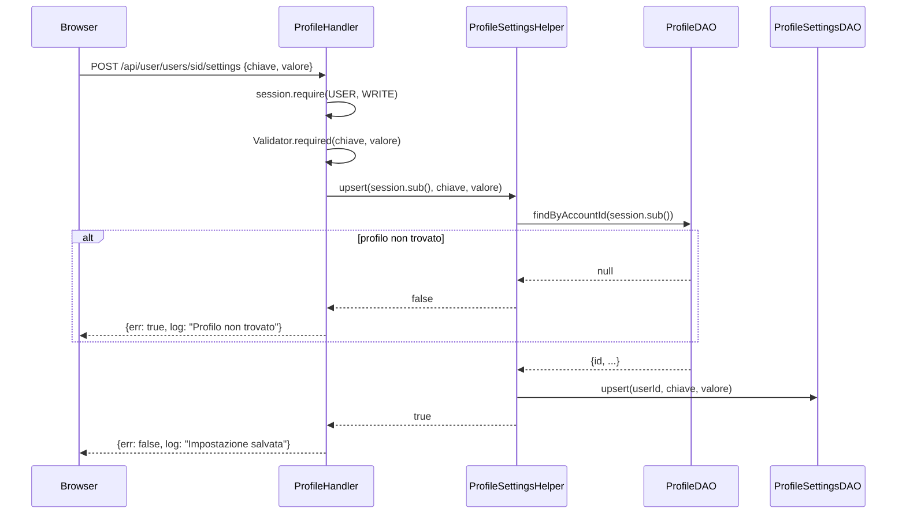
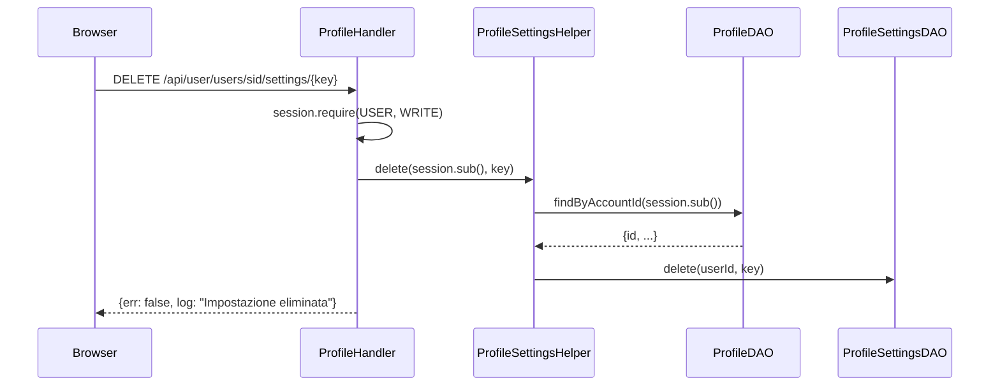

# WF-USER-011-GESTIONE-IMPOSTAZIONI-PROFILO

### Gestione impostazioni profilo

### Obiettivo

Consentire all'utente autenticato di leggere, salvare ed eliminare impostazioni chiave/valore associate al proprio profilo. Le impostazioni sono coppie `{chiave, valore}` archiviate in `jms_user_settings` e legate al profilo (non all'account). L'upsert crea la riga se non esiste, altrimenti aggiorna il valore.

### Attori

* Utente autenticato (`Browser`)
* Handler profilo (`ProfileHandler.settings`, `ProfileHandler.addSetting`, `ProfileHandler.settingByKey`, `ProfileHandler.deleteSetting`)
* Helper impostazioni (`ProfileSettingsHelper`)
* DAO profilo (`ProfileDAO`)
* DAO impostazioni (`ProfileSettingsDAO`)

### Precondizioni

* Utente autenticato con ruolo USER+
* Per le operazioni di scrittura: il profilo (`jms_users`) deve esistere; se non esiste, `addSetting` risponde con errore `"Profilo non trovato"`

---

### Flusso — Lettura tutte le impostazioni

1. Browser invia `GET /api/user/users/sid/settings`
2. `ProfileHandler.settings` richiede `session.require(USER, READ)`
3. `ProfileSettingsHelper.getAll(session.sub())`:
   * `ProfileDAO.findByAccountId(session.sub())` → recupera il profilo
   * Se profilo non trovato → restituisce `null`; handler risponde con lista vuota `[]`
   * `ProfileSettingsDAO.findAllByUserId(userId)` → `SELECT ... FROM jms_user_settings WHERE user_id = ?`
4. Risposta: `{err: false, out: [{chiave, valore, ...}, ...]}`

### Flusso — Lettura impostazione singola

1. Browser invia `GET /api/user/users/sid/settings/{key}`
2. `ProfileHandler.settingByKey` richiede `session.require(USER, READ)`
3. `ProfileSettingsHelper.getAll(session.sub())` → recupera tutte le impostazioni
4. Scorre la lista cercando la riga con `chiave == key`
5. Se non trovata → errore `"Impostazione non trovata"`
6. Risposta: `{err: false, out: {chiave, valore, ...}}`

### Flusso — Creazione o aggiornamento impostazione

1. Browser invia `POST /api/user/users/sid/settings` con `{chiave, valore}`
2. `ProfileHandler.addSetting` richiede `session.require(USER, WRITE)`
3. Valida `chiave` e `valore` obbligatori
4. `ProfileSettingsHelper.upsert(session.sub(), chiave, valore)`:
   * `ProfileDAO.findByAccountId(session.sub())` → recupera il profilo
   * Se profilo non trovato → restituisce `false`; handler risponde con errore `"Profilo non trovato"`
   * `ProfileSettingsDAO.upsert(userId, chiave, valore)` → `INSERT ... ON CONFLICT (user_id, chiave) DO UPDATE SET valore = ?`
5. Risposta: `{err: false, log: "Impostazione salvata"}`

### Flusso — Eliminazione impostazione

1. Browser invia `DELETE /api/user/users/sid/settings/{key}`
2. `ProfileHandler.deleteSetting` richiede `session.require(USER, WRITE)`
3. `ProfileSettingsHelper.delete(session.sub(), key)`:
   * `ProfileDAO.findByAccountId(session.sub())` → recupera il profilo
   * Se profilo non trovato → restituisce `false` (l'handler non verifica il risultato)
   * `ProfileSettingsDAO.delete(userId, chiave)` → `DELETE FROM jms_user_settings WHERE user_id = ? AND chiave = ?`
4. Risposta: `{err: false, log: "Impostazione eliminata"}`

---

### Postcondizioni

* **Lettura**: nessuna modifica; lista o valore singolo restituiti
* **Upsert**: riga in `jms_user_settings` creata o aggiornata
* **Eliminazione**: riga rimossa; se la chiave non esisteva, l'operazione è idempotente (nessun errore)

---

### Diagramma di sequenza — Lettura tutte le impostazioni

### Diagramma di sequenza — Lettura impostazione singola

### Diagramma di sequenza — Creazione/Aggiornamento impostazione

### Diagramma di sequenza — Eliminazione impostazione

