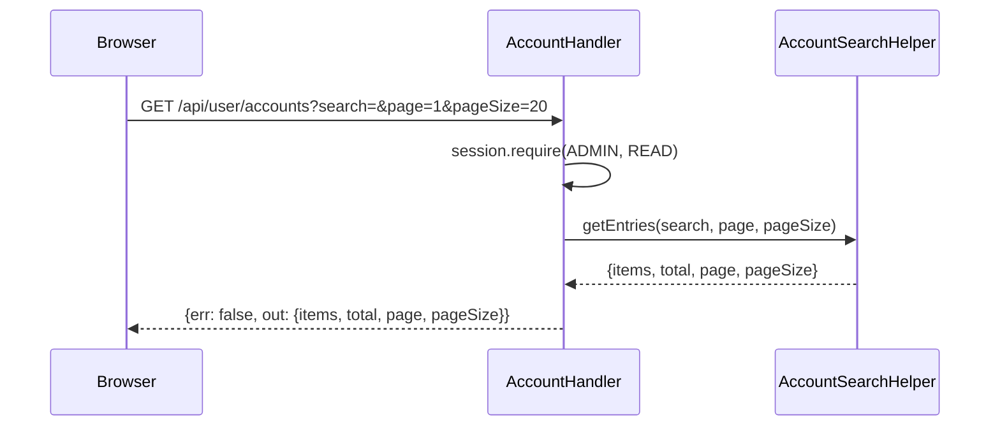
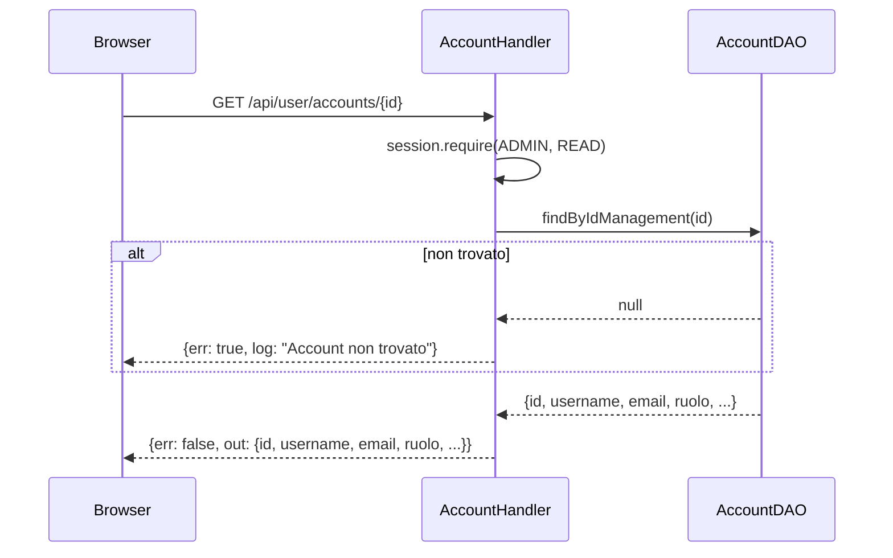
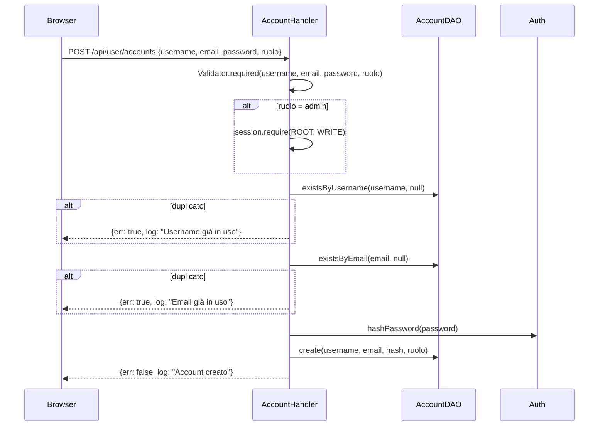
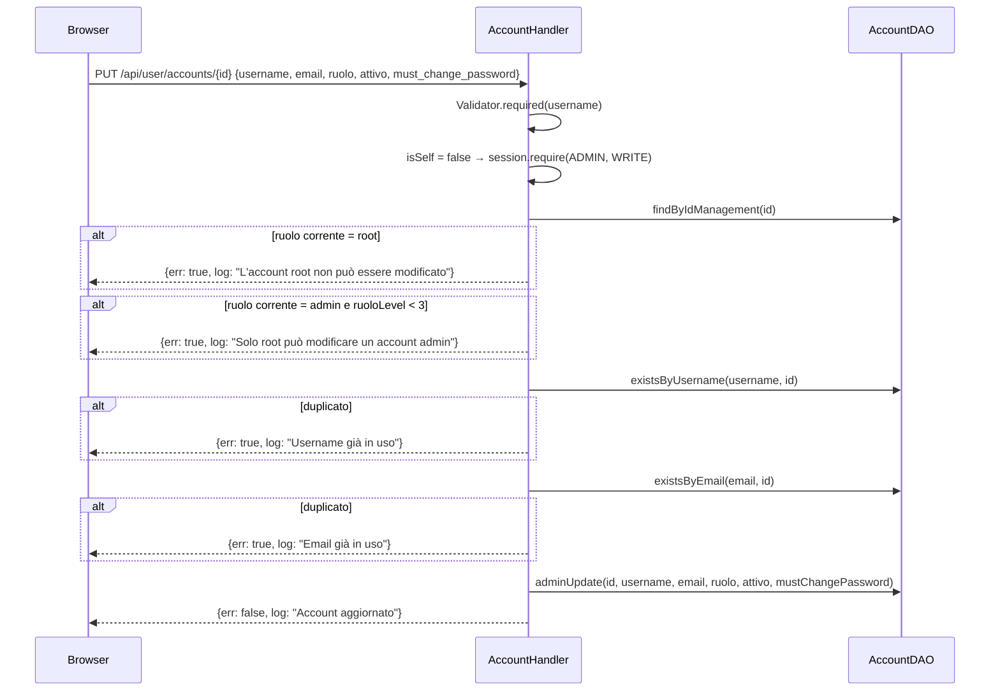
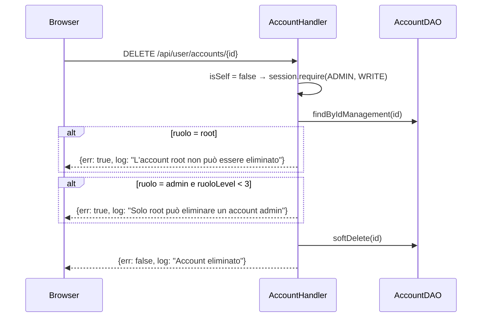
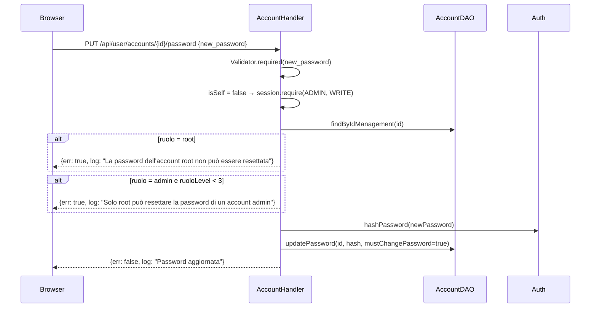

# WF-USER-012-GESTIONE-UTENTI-ADMIN

### Gestione utenti (pannello amministrativo)

### Obiettivo

Consentire a un operatore con ruolo ADMIN+ di consultare, creare, modificare, disattivare e resettare la password degli account utente. Le operazioni usano gli stessi endpoint delle operazioni self, ma il comportamento varia in base a `id == session.sub()` (self) vs `id != session.sub()` (admin). La gerarchia dei ruoli limita le azioni: ADMIN gestisce solo account user; ROOT gestisce anche gli account admin.

### Attori

* Operatore ADMIN o ROOT (`Browser`)
* Handler account (`AccountHandler.list`, `AccountHandler.byId`, `AccountHandler.register`, `AccountHandler.update`, `AccountHandler.delete`, `AccountHandler.changePassword`)
* Helper ricerca (`AccountSearchHelper`)
* DAO account (`AccountDAO`)
* `Auth`

### Precondizioni

* Utente autenticato con ruolo ADMIN+
* Per le operazioni su account admin: ruolo ROOT richiesto

---

### Flusso — Lista paginata account

1. Browser invia `GET /api/user/accounts?search=&page=1&pageSize=20`
2. `AccountHandler.list` richiede `session.require(ADMIN, READ)`
3. `AccountSearchHelper.getEntries(search, page, pageSize)` → query con `ILIKE` su `username` e `email`, paginazione con `LIMIT/OFFSET`
4. Risposta: `{err: false, out: {items: [...], total, page, pageSize}}`

### Flusso — Lettura singolo account

1. Browser invia `GET /api/user/accounts/{id}`
2. `AccountHandler.byId` richiede `session.require(ADMIN, READ)`
3. `AccountDAO.findByIdManagement(id)` → `SELECT id, username, email, ruolo, attivo, must_change_password, created_at WHERE id = ?`
4. Se non trovato → errore `"Account non trovato"`
5. Risposta: `{err: false, out: {id, username, email, ruolo, attivo, must_change_password, created_at}}`

### Flusso — Creazione account

1. Browser invia `POST /api/user/accounts` con `{username, email, password, ruolo}`
2. `AccountHandler.register` valida `username`, `email`, `password`, `ruolo` obbligatori
3. Se `ruolo = 'admin'` → `session.require(ROOT, WRITE)` (solo ROOT può creare admin)
4. Se `ruolo != 'user'` e `ruolo != 'admin'` → errore `"Ruolo non valido. Valori accettati: user, admin"`
5. `AccountDAO.existsByUsername(username, null)` → se duplicato, errore `"Username già in uso"`
6. `AccountDAO.existsByEmail(email, null)` → se duplicato, errore `"Email già in uso"`
7. `AccountDAO.create(username, email, Auth.hashPassword(password), ruolo)`
8. Risposta: `{err: false, log: "Account creato"}`

### Flusso — Aggiornamento account

1. Browser invia `PUT /api/user/accounts/{id}` con `{username, email, ruolo, attivo, must_change_password}`
2. `AccountHandler.update` valida `username` obbligatorio; rileva `isSelf = false`
3. `session.require(ADMIN, WRITE)`
4. `AccountDAO.findByIdManagement(id)` → recupera ruolo corrente dell'account
5. Se `ruolo corrente = 'root'` → errore `"L'account root non può essere modificato"`
6. Se `ruolo corrente = 'admin'` e `session.ruoloLevel() < 3` → errore `"Solo root può modificare un account admin"`
7. Se `ruolo nuovo != 'user'` e `ruolo nuovo != 'admin'` → errore `"Ruolo non valido. Valori accettati: user, admin"`
8. Se `ruolo nuovo = 'admin'` e `session.ruoloLevel() < 3` → errore `"Solo root può assegnare il ruolo admin"`
9. `AccountDAO.existsByUsername(username, id)` → se duplicato, errore `"Username già in uso"`
10. `AccountDAO.existsByEmail(email, id)` → se duplicato, errore `"Email già in uso"`
11. `AccountDAO.adminUpdate(id, username, email, ruolo, attivo, mustChangePassword)`
12. Risposta: `{err: false, log: "Account aggiornato"}`

### Flusso — Disattivazione account

1. Browser invia `DELETE /api/user/accounts/{id}`
2. `AccountHandler.delete` rileva `isSelf = false` → `session.require(ADMIN, WRITE)`
3. `AccountDAO.findByIdManagement(id)` → recupera ruolo corrente
4. Se `ruolo = 'root'` → errore `"L'account root non può essere eliminato"`
5. Se `ruolo = 'admin'` e `session.ruoloLevel() < 3` → errore `"Solo root può eliminare un account admin"`
6. `AccountDAO.softDelete(id)` → `UPDATE SET attivo = false`
7. Risposta: `{err: false, log: "Account eliminato"}`

### Flusso — Reset password

1. Browser invia `PUT /api/user/accounts/{id}/password` con `{new_password}`
2. `AccountHandler.changePassword` valida `new_password` obbligatorio; rileva `isSelf = false`
3. `session.require(ADMIN, WRITE)`
4. `AccountDAO.findByIdManagement(id)` → recupera ruolo corrente
5. Se `ruolo = 'root'` → errore `"La password dell'account root non può essere resettata"`
6. Se `ruolo = 'admin'` e `session.ruoloLevel() < 3` → errore `"Solo root può resettare la password di un account admin"`
7. `AccountDAO.updatePassword(id, Auth.hashPassword(newPassword), mustChangePassword = true)`
8. Risposta: `{err: false, log: "Password aggiornata"}`

---

### Postcondizioni

* **Lista / Lettura**: nessuna modifica al DB
* **Creazione**: nuovo record in `jms_accounts`
* **Aggiornamento**: `username`, `email`, `ruolo`, `attivo`, `must_change_password` aggiornati in `jms_accounts`
* **Disattivazione**: `attivo = false`; i refresh token esistenti rimangono ma login e refresh saranno rifiutati
* **Reset password**: hash aggiornato, `must_change_password = true` (l'utente dovrà cambiarla al prossimo accesso)

---

### Gerarchia dei ruoli

| Operazione       | Eseguita da | Su account `user` | Su account `admin` | Su account `root` |
|------------------|-------------|-------------------|--------------------|-------------------|
| Lista / Lettura  | ADMIN+      | ✓                 | ✓                  | ✓                 |
| Crea `user`      | (nessuna auth) | ✓              | —                  | —                 |
| Crea `admin`     | ROOT        | —                 | ✓                  | —                 |
| Aggiorna         | ADMIN       | ✓                 | solo ROOT          | ✗                 |
| Disattiva        | ADMIN       | ✓                 | solo ROOT          | ✗                 |
| Reset password   | ADMIN       | ✓                 | solo ROOT          | ✗                 |

---

### Diagramma di sequenza — Lista paginata account

### Diagramma di sequenza — Lettura singolo account

### Diagramma di sequenza — Creazione account

### Diagramma di sequenza — Aggiornamento account

### Diagramma di sequenza — Disattivazione account

### Diagramma di sequenza — Reset password

